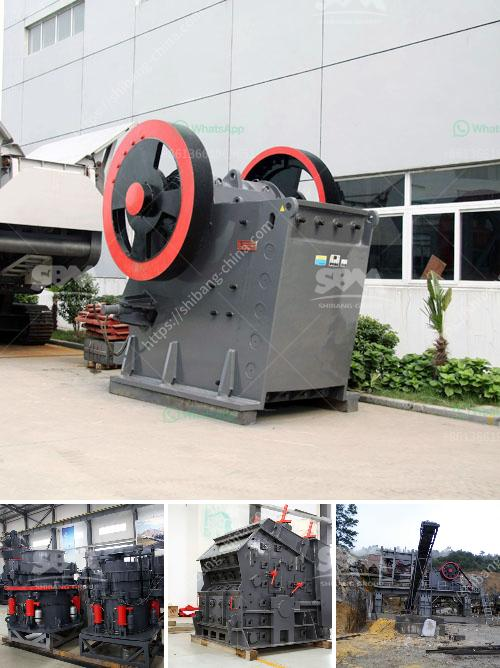

<h3>price of ball mill for sale</h3>
The price of a ball mill for sale will depend on several factors, including the models of the equipment, the energy efficiency, and the type of material being milled. A well-designed ball mill with good performance price ratio will bring more profits to customers.

In recent years, with the rapid development of the mining industry, there has been a growing demand for ball mills. Various types of ball mills have appeared in the market, which leads to the increasing competition between different ball mill manufacturers. Choosing a suitable ball mill supplier is essential for the efficiency and economy of the ball mill equipment.

When buying a ball mill, customers often consider the price of the equipment. As a piece of capital equipment, a ball mill is expensive upfront but it can have long-term benefits in terms of energy efficiency and reduced maintenance costs. Therefore, it is wise to invest in a high-quality, durable ball mill that offers good performance at a reasonable price.

The price of a ball mill for sale can vary depending on various factors, such as the brand, size, capacity, type of material being milled, and the specific requirements of the customer. By considering the aforementioned factors, potential buyers can ensure that they select the most suitable ball mill that meets their needs and budget.

It is essential to do thorough research and compare prices from different suppliers to ensure that you are getting the best value for your money. Moreover, it is advisable to consult with experts or professionals in the mining industry to get their opinions and recommendations on the best ball mill options available in the market.

In conclusion, the price of a ball mill for sale should be considered alongside other factors before making a purchase. Investing in a high-quality and reliable ball mill will bring long-term benefits and profits to the customers. Therefore, it is essential to conduct thorough research, compare prices, and consult experts to make an informed decision.
<h3>Contact us</h3><ul><li><strong>Whatsapp:&nbsp;<a href="https://wa.me/8613661969651">+8613661969651</a></strong></li><li><a href="https://swt.shibang-china.com/?git&amp;zhl&amp;price of ball mill for sale"><strong>Online Service(chat now)</strong></a></li></ul><h3>Related</h3><ul><li><a href='plant project report pdf stone crushing.md'>plant project report pdf stone crushing</a></li><li><a href='crsusher plant in the philippines.md'>crsusher plant in the philippines</a></li><li><a href='used heavy duty jaw crushing machine.md'>used heavy duty jaw crushing machine</a></li><li><a href='top ten cement plant epc contractor.md'>top ten cement plant epc contractor</a></li><li><a href='stone quarry business proposal crusher machine.md'>stone quarry business proposal crusher machine</a></li></ul>