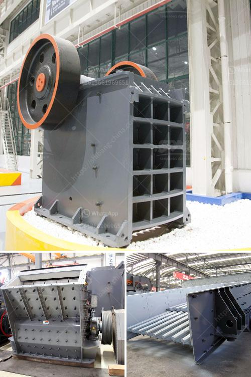

<h3>price of crusher sand in tons south africa</h3>
The price of crusher sand in South Africa will vary according to the buyers' specifications and the specific locations where the sand is being sourced from. The average price of crusher sand is about $9 per ton. The average production cost of sand is about $5.80 per ton, excluding transportation. The cost of transporting the sand varies depending on the distance and mode of transportation, as well as any additional handling or processing fees.

In South Africa, crusher sand is a common type of sand used in construction projects and can be obtained from various sources. It is usually produced from quarries where rock is crushed and sieved to create different sized particles suitable for various applications. The sand is then washed to remove any impurities and to ensure its quality.

The price of crusher sand can vary depending on factors such as availability, demand, and location. Areas with high demand for construction materials may have higher prices due to increased competition. Similarly, areas with limited access to natural sources of sand may have higher prices due to transportation costs.

The quality of crusher sand can also impact its price. High-quality sand that meets specific technical specifications may be more expensive than generic sand. Some construction projects may require sand with specific properties, such as a certain particle size distribution or a specific chemical composition. In such cases, the price of crusher sand may reflect the additional effort and resources required to produce sand with these specific characteristics.

Although the price of crusher sand in South Africa is relatively low compared to other construction materials, it is still a significant cost factor in construction projects. Contractors and builders should carefully consider their sand requirements and evaluate the different sand suppliers available, considering both price and quality.

It is also important to note that the price of crusher sand may vary between regions within South Africa. Transportation costs can be a significant factor, especially for projects located far from the source of the sand. Contractors should consider sourcing sand from nearby quarries to minimize transportation costs.

In conclusion, the price of crusher sand in South Africa can range from $9 to $11 per ton, depending on factors such as availability, demand, and location. Contractors and builders should carefully evaluate their sand requirements and choose a supplier that offers a good balance between price and quality. Additionally, sourcing sand from nearby quarries can help reduce transportation costs.
<h3>Contact us</h3><ul><li><strong>Whatsapp:&nbsp;<a href="https://wa.me/8613661969651">+8613661969651</a></strong></li><li><a href="https://swt.shibang-china.com/?git&amp;zhl&amp;price of crusher sand in tons south africa"><strong>Online Service(chat now)</strong></a></li></ul><h3>Related</h3><ul><li><a href='price of stone crusher capacitytons an hour.md'>price of stone crusher capacitytons an hour</a></li><li><a href='concrete crusher for sale in uae crusher.md'>concrete crusher for sale in uae crusher</a></li><li><a href='quartz production line.md'>quartz production line</a></li><li><a href='cone crusher plant for sale.md'>cone crusher plant for sale</a></li><li><a href='gold processing equipment price in ghana.md'>gold processing equipment price in ghana</a></li></ul>