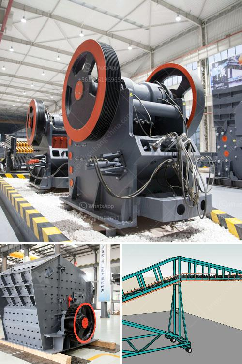

<h3>price of grinder machine in india</h3>
India, being a developing nation, has witnessed a vast expansion of various industries over the past few decades. These industries, ranging from construction to food processing, heavily rely on machinery and equipment to streamline their operations and increase productivity. One such essential machinery is the grinder machine, which has become a staple in many industries. In this article, we will explore the price range of grinder machines in India.

Grinder machines come in various types, catering to different industries' unique requirements. The price of these machines varies based on factors like the type of grinder, its capacity, features, and brand value. 

In the Indian market, grinder machines are available in a wide price range, starting as low as INR 1,000 for simple hand-operated models. These machines are suitable for small-scale businesses or personal use. As the complexity and capacity increase, so does the price. Mid-range grinder machines, suitable for small shops or household needs, are usually priced between INR 3,000 to INR 10,000.

Industrial-grade grinder machines, capable of heavy-duty applications, have higher prices due to their larger capacity and advanced features. These machines are designed to handle bulk quantities efficiently and can cost anywhere between INR 15,000 to INR 50,000.

When it comes to renowned brands, the price can be slightly higher due to brand reputation, quality assurance, and after-sales service. Well-established Indian brands like Bajaj, Philips, and Prestige offer grinder machines starting from INR 2,000 and can go up to INR 15,000, depending on the model and capacity. International brands like Panasonic and Bosch also have a strong presence in the Indian market, with prices ranging from INR 3,000 to INR 25,000.

However, it is crucial to note that these prices are approximate figures, and the market is highly competitive, with frequent discounts and offers. It is advisable to compare prices from different sellers and consider customer reviews and ratings before making a purchase. Additionally, considering the warranty period and availability of spare parts and service centers is crucial to ensure a smooth experience in the long run.

In conclusion, the price of grinder machines in India varies based on factors like type, capacity, features, and brand value. From affordable hand-operated models to high-capacity industrial-grade machines, the market offers a wide range of options. One should carefully assess their requirements and budget, and consider factors like brand reputation and after-sales service to make an informed decision.
<h3>Contact us</h3><ul><li><strong>Whatsapp:&nbsp;<a href="https://wa.me/8613661969651">+8613661969651</a></strong></li><li><a href="https://swt.shibang-china.com/?git&amp;zhl&amp;price of grinder machine in india"><strong>Online Service(chat now)</strong></a></li></ul><h3>Related</h3><ul><li><a href='buy mobile crusher in usa.md'>buy mobile crusher in usa</a></li><li><a href='mobile gold processing 20 tph.md'>mobile gold processing 20 tph</a></li><li><a href='cost to construct a cement factory.md'>cost to construct a cement factory</a></li><li><a href='lime powder marking machines.md'>lime powder marking machines</a></li><li><a href='mini jaw crusher saudi.md'>mini jaw crusher saudi</a></li></ul>