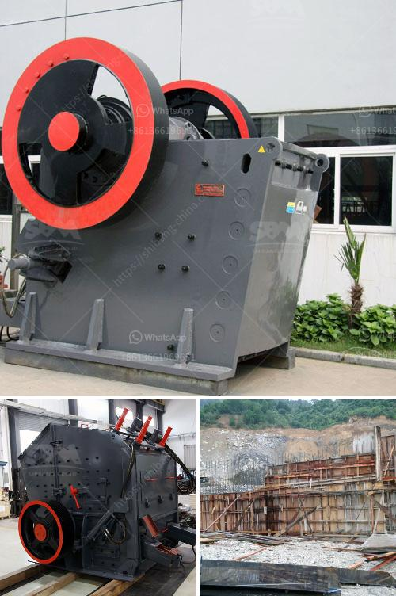

<h3>price of grinding machine</h3>
Grinding machines are used to remove unwanted material from a workpiece through the process of abrasion. As an essential tool in the metalworking industry, they provide the efficiency and precision necessary for fabricating a wide range of products. However, the price of a grinding machine can vary significantly depending on various factors. In this article, we will explore the different aspects that impact the cost of a grinding machine.

One of the primary factors that affect the price of a grinding machine is the type of machine being purchased. There are various types of grinding machines available in the market, each serving a specific purpose. For instance, bench grinders are compact machines used for sharpening tools and rough grinding, while cylindrical grinders are more substantial machines used for precision grinding of cylindrical surfaces. Naturally, the larger and more specialized the machine, the higher the price tag.

Another key factor in determining the price of a grinding machine is its power source. Grinding machines can be powered by electricity, petrol, or compressed air, with each having its own benefits and associated costs. Electric grinding machines offer the advantage of being more environmentally friendly and cost-efficient in the long run, but they might require a higher initial investment. On the other hand, petrol-powered machines provide mobility and flexibility but may entail higher operational expenses due to fuel consumption.

The size and capacity of a grinding machine also impact its price. Machines with larger work areas or higher grinding capabilities tend to be more expensive. This is because they require stronger and more sophisticated components to handle the increased workload. Furthermore, advanced features such as automated controls, digital displays, and specialized attachments may further elevate the price, as they enhance the machine's versatility and ease of use.

The brand and quality of a grinding machine can also significantly influence its price. Well-known brands with a reputation for durability and performance often command higher prices. While opting for a high-quality machine ensures reliable and consistent performance, it is essential to strike a balance between cost and functionality to meet specific project requirements.

Additional factors that might affect the price of a grinding machine include warranty duration, customer support, and after-sales service. Machines with longer warranties and better customer support tend to have higher upfront costs but can save money in the long run by minimizing repair and maintenance expenses. Moreover, manufacturers that offer comprehensive after-sales service, including training, spare parts availability, and technical support, may charge a premium for their products.

It is crucial to invest in a grinding machine that strikes the right balance between price and quality to suit one's specific requirements. While it may seem tempting to opt for a cheaper alternative, it is essential to evaluate the long-term costs and benefits. A higher-priced, high-quality grinding machine is likely to deliver better performance, lower maintenance costs, and provide better overall value for money.

In conclusion, the price of a grinding machine can vary significantly depending on factors such as the type of machine, power source, size, brand, and quality. When purchasing a grinding machine, it is crucial to consider one's specific needs, projected workload, and budget. Investing in a high-quality machine may require a greater upfront investment, but it ensures reliable performance, longevity, and overall cost-effectiveness in the long run.
<h3>Contact us</h3><ul><li><strong>Whatsapp:&nbsp;<a href="https://wa.me/8613661969651">+8613661969651</a></strong></li><li><a href="https://swt.shibang-china.com/?git&amp;zhl&amp;price of grinding machine"><strong>Online Service(chat now)</strong></a></li></ul><h3>Related</h3><ul><li><a href='graphite beneficiation plant for sale.md'>graphite beneficiation plant for sale</a></li><li><a href='size ball mills for miner.md'>size ball mills for miner</a></li><li><a href='impact of fator on coal crusher.md'>impact of fator on coal crusher</a></li><li><a href='grinding media balls turkey.md'>grinding media balls turkey</a></li><li><a href='stone jaw crusher machinery supplier.md'>stone jaw crusher machinery supplier</a></li></ul>