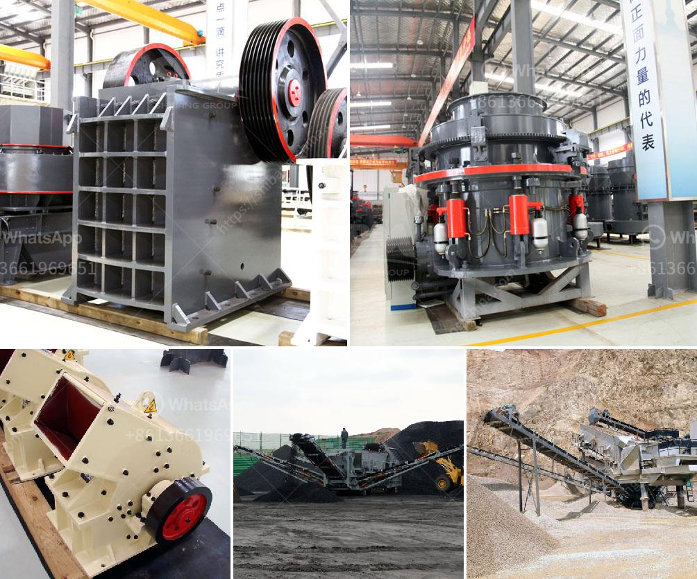

<h3>price of grinding powder manufacturing machine</h3>
Grinding powder machines have become indispensable tools in various industries, such as pharmaceutical, chemical, and food processing. These machines are used to reduce large quantities of materials into fine powders, enabling easier handling, mixing, and storage. However, potential buyers may wonder about the price range of these machines to make an informed investment decision. In this article, we will delve into the cost of manufacturing grinding powder machines, highlighting their advantages and justifying why they are a worthwhile investment.

The price of grinding powder manufacturing machines can vary greatly depending on several factors, such as their features, capacity, and complexity. Generally, the cost ranges between $1,000 and $50,000 or even more. Small-scale machines with basic functionalities offering limited production capacity usually fall within the lower end of the price range. In contrast, larger machines with advanced technologies, high production capacities, and automation features fetch higher prices. However, it is essential to consider the long-term benefits, durability, and reliability when evaluating the cost of these machines.

1. Increased Efficiency: Grinding powder machines significantly enhance productivity and efficiency by reducing material size and improving product quality. This results in reduced labor costs, improved processing times, and higher overall output.

2. Consistency and Uniformity: These machines ensure the desired particle size distribution, enabling consistent product quality. They are equipped with cutting-edge technologies that provide precise control over milling processes, resulting in uniform and homogenous particle sizes.

3. Versatility: Grinding powder machines can handle a wide range of materials, including but not limited to minerals, chemicals, herbs, pharmaceuticals, and food products. This versatility makes them suitable for various industries, ensuring a wide customer base for end-users of these machines.

4. Customization: Manufacturers often offer customizable options for grinding powder machines. This allows businesses to tailor the equipment based on their specific production requirements, enhancing efficiency and reducing waste.

While the price of grinding powder manufacturing machines may seem significant, it is crucial to consider the long-term benefits and advantages they provide for businesses. These machines significantly improve productivity, ensure consistency, and offer versatility in handling different types of materials. The cost of these machines can vary depending on their size, functionality, and production capacity. However, it is a worthwhile investment when considering the substantial returns in terms of improved efficiency, output quality, and reduced labor costs. Businesses that require fine powder materials as part of their operations can benefit greatly from investing in grinding powder machines, ultimately improving their overall competitiveness in the market.
<h3>Contact us</h3><ul><li><strong>Whatsapp:&nbsp;<a href="https://wa.me/8613661969651">+8613661969651</a></strong></li><li><a href="https://swt.shibang-china.com/?git&amp;zhl&amp;price of grinding powder manufacturing machine"><strong>Online Service(chat now)</strong></a></li></ul><h3>Related</h3><ul><li><a href='coal crusher and screen plant for sale.md'>coal crusher and screen plant for sale</a></li><li><a href='german stone grinding machine manufacturer.md'>german stone grinding machine manufacturer</a></li><li><a href='hydrated lime machine.md'>hydrated lime machine</a></li><li><a href='the world largest mobile crusher.md'>the world largest mobile crusher</a></li><li><a href='the largest stone crusher system.md'>the largest stone crusher system</a></li></ul>