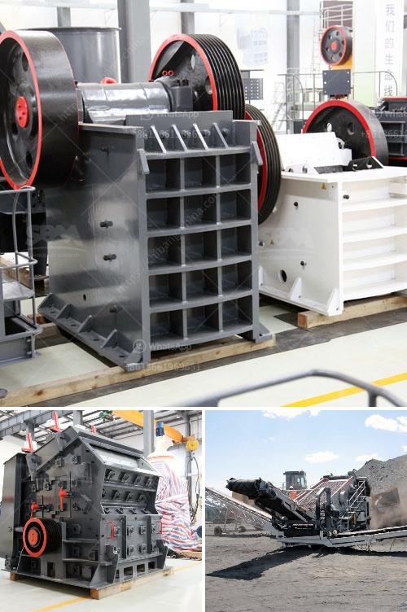

<h3>price of gypsum plant</h3>
The price of a gypsum plant can vary depending on several factors such as the size, capacity, and technology of the plant. Gypsum plants are used to manufacture gypsum powder, which is a building material widely used in the construction industry. It is primarily used as a binder in wallboard, or drywall, but also has numerous other applications.

One of the key factors influencing the price of a gypsum plant is its size and capacity. Larger plants with higher production capacities are generally more expensive. This is because they require more machinery, equipment, and resources to operate efficiently. The cost of land and infrastructure can also play a significant role in determining the price of a gypsum plant, especially if it is located in areas with high real estate values.

Another factor that affects the price is the technology used in the plant. Advanced and modern gypsum plants equipped with the latest machinery and automation systems tend to be more expensive. However, these plants offer several advantages, including higher production efficiency, improved product quality, and reduced energy consumption. Therefore, investing in a technologically advanced gypsum plant can be more profitable in the long run, even if the upfront cost is higher.

Additionally, the price of a gypsum plant can also be influenced by the raw material sourcing strategy. Gypsum, the main raw material used in the manufacturing process, is widely available in nature. However, the cost of transporting gypsum from the mine to the plant can vary depending on the distance and accessibility. Therefore, it is important for gypsum plant owners to consider the proximity of gypsum mines to their plant location in order to minimize transportation costs.

Other factors that can affect the price of a gypsum plant include labor costs, regulatory requirements, and market demand. Labor costs can vary significantly across different regions, and it is essential to consider these costs when determining the overall investment required for the plant. Regulatory requirements also play a role in the price, as compliance with environmental and safety standards may necessitate additional investments.

Furthermore, the current market demand for gypsum products can influence the price of a gypsum plant. If there is high demand for gypsum products, such as during construction booms, the price of a gypsum plant may be higher due to increased competition and demand. On the other hand, during economic downturns or periods of low demand, gypsum plant prices may be more competitive as manufacturers aim to attract potential buyers.

In conclusion, the price of a gypsum plant can vary significantly depending on its size, capacity, technology, raw material sourcing, labor costs, regulatory requirements, and market demand. It is important for potential investors in the gypsum industry to thoroughly analyze these factors and conduct a cost-benefit analysis before making an investment decision. Additionally, considering the long-term profitability and sustainability of the plant is crucial, as a higher initial investment may result in lower operational costs and higher returns in the future.
<h3>Contact us</h3><ul><li><strong>Whatsapp:&nbsp;<a href="https://wa.me/8613661969651">+8613661969651</a></strong></li><li><a href="https://swt.shibang-china.com/?git&amp;zhl&amp;price of gypsum plant"><strong>Online Service(chat now)</strong></a></li></ul><h3>Related</h3><ul><li><a href='china crusher exporters mails hotmail com.md'>china crusher exporters mails hotmail com</a></li><li><a href='ball mills in lima.md'>ball mills in lima</a></li><li><a href='harare changfa diesel engine.md'>harare changfa diesel engine</a></li><li><a href='mining process of limestone.md'>mining process of limestone</a></li><li><a href='roller mill dimensions.md'>roller mill dimensions</a></li></ul>