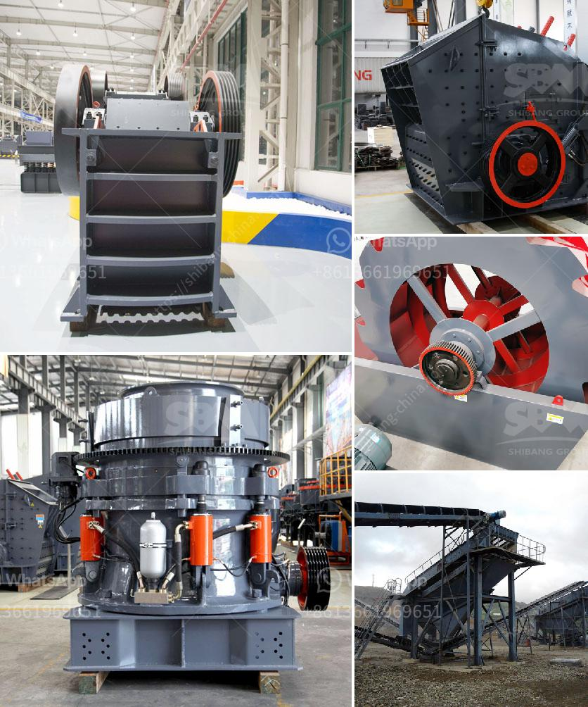

<h3>price of hammer mill in china</h3>
China is known for its manufacturing prowess, being the world's factory for a wide range of products. From smartphones to automobiles, Chinese factories produce goods that are exported worldwide. One such product is the hammer mill, a versatile grinding machine that is utilized in various industries.

The hammer mill is a cost-effective and efficient machine used in the grinding and processing of raw materials such as agricultural materials, biomass waste, wood chips, corn, sorghum, grain, feed, fruit shells, herbs, and other materials. It is primarily used in the feed and grain industry, but its applications extend to other sectors like pharmaceuticals, chemicals, and the recycling industry.

When it comes to the price of hammer mills in China, several factors come into play. Primarily, the cost depends on the specifications and features of the machine. Hammer mills come in various sizes and capacities, ranging from small-scale machines designed for home use to industrial-sized mills utilized in large-scale production.

The prices of hammer mills can also vary depending on the brand and manufacturer. China is home to many manufacturers and suppliers of hammer mills, each with its reputation and level of expertise. Some well-known Chinese brands produce high-quality hammer mills that are reliable and durable, commanding higher prices. On the other hand, lesser-known brands offer more affordable options while still maintaining acceptable quality.

Besides the specifications and the brand reputation, the cost may also be influenced by production costs and economic factors. Labor costs, raw material costs, and even currency exchange rates can all affect the price of hammer mills. Generally, China offers competitive prices for its products due to its high production capabilities and economies of scale.

To give an idea of the price range, a small-scale hammer mill suitable for home use can range from around $800 to $2000. These machines typically have a low capacity and horsepower suited for light-duty grinding tasks. In contrast, medium to large-scale hammer mills designed for industrial use can cost anywhere from $3000 to $20,000 or more, depending on the specifications and brand.

It is worth noting that the prices mentioned here are merely estimates and may vary depending on many factors. It is advisable to contact specific manufacturers or suppliers to get accurate pricing information.

When considering purchasing a hammer mill from China, it is essential to consider the quality, reliability, and after-sales support offered by the manufacturer. Reliable manufacturers will provide warranty and technical support to ensure smooth operation and durability of the machine.

In conclusion, the price of hammer mills in China varies depending on factors such as specifications, brand reputation, and economic conditions. With China's manufacturing prowess, buyers have a wide range of options to choose from, regardless of their budget or application requirements.
<h3>Contact us</h3><ul><li><strong>Whatsapp:&nbsp;<a href="https://wa.me/8613661969651">+8613661969651</a></strong></li><li><a href="https://swt.shibang-china.com/?git&amp;zhl&amp;price of hammer mill in china"><strong>Online Service(chat now)</strong></a></li></ul><h3>Related</h3><ul><li><a href='sand washing plant in south africa.md'>sand washing plant in south africa</a></li><li><a href='aggregate mining process.md'>aggregate mining process</a></li><li><a href='used stone crusher on sale in jharkhand.md'>used stone crusher on sale in jharkhand</a></li><li><a href='crusher stone for sale.md'>crusher stone for sale</a></li><li><a href='hydrated lime machine.md'>hydrated lime machine</a></li></ul>