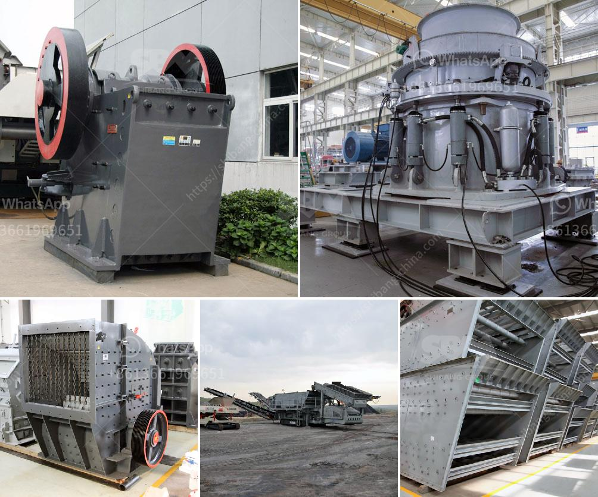

<h3>price of industrial conveyor belt for sale</h3>
Industrial conveyor belts are essential components in various manufacturing and production industries. They play a crucial role in ensuring the smooth and efficient movement of materials, products, and goods throughout the production process. However, when businesses are in need of a new conveyor belt, the price can be a major deciding factor. In this article, we will explore the price range of industrial conveyor belts for sale.

The price of an industrial conveyor belt depends on several factors, including the size and length of the belt, the materials used in its construction, and the complexity of the conveyor system. Generally, conveyor belts are priced by the square foot or by the linear foot.

The most basic conveyor belts are made of rubber, and they are the most affordable option. Prices for rubber conveyor belts typically range from $50 to $100 per linear foot. However, rubber belts are not suitable for all applications, especially those that involve high temperatures or harsh chemicals.

For industries that require more durability and resistance to extreme conditions, there are conveyor belts made of materials like steel, nylon, or polyester. These belts are more expensive due to their superior strength and longevity. Prices for steel conveyor belts range from $300 to $500 per linear foot, while nylon and polyester belts can cost between $200 and $400 per linear foot.

In addition to the base price of the conveyor belt, businesses should also consider additional costs associated with installation and maintenance. Depending on the complexity of the conveyor system, installation costs can range from a few hundred dollars to several thousand dollars. It is crucial to consult with a professional installer or supplier to get an accurate estimate for installation costs.

Maintenance costs should also be taken into account when considering the price of an industrial conveyor belt. Regular maintenance and inspections can help extend the lifespan of the belt and ensure optimal functioning. However, businesses should budget for occasional repairs and replacements, which can add to the overall cost.

When purchasing an industrial conveyor belt, businesses should not solely focus on price. It is essential to consider the overall quality, reliability, and durability of the belt. Investing in a high-quality conveyor belt can save businesses money in the long run by reducing downtime and minimizing the need for frequent repairs or replacements.

To find the best-priced conveyor belts, businesses can explore different suppliers and compare quotes. It is crucial to consider not only the upfront cost but also the reputation and customer reviews of the supplier. Additionally, businesses should inquire about any warranties or guarantees offered by the supplier to ensure their investment is protected.

In conclusion, the price of industrial conveyor belts can vary greatly depending on factors such as size, materials, and complexity. Rubber belts tend to be the most affordable option, while belts made of steel, nylon, or polyester are more expensive due to their superior durability. When considering the price, businesses should also factor in installation and maintenance costs, as well as the overall quality and reliability of the belt. By carefully considering all of these factors, businesses can make an informed decision and find the best-priced conveyor belt for their specific needs.
<h3>Contact us</h3><ul><li><strong>Whatsapp:&nbsp;<a href="https://wa.me/8613661969651">+8613661969651</a></strong></li><li><a href="https://swt.shibang-china.com/?git&amp;zhl&amp;price of industrial conveyor belt for sale"><strong>Online Service(chat now)</strong></a></li></ul><h3>Related</h3><ul><li><a href='alluvial gold mining project proposal.md'>alluvial gold mining project proposal</a></li><li><a href='impact crushing machine manufacturer.md'>impact crushing machine manufacturer</a></li><li><a href='calculations on the capacity of cone crusher.md'>calculations on the capacity of cone crusher</a></li><li><a href='msme ball mill project report.md'>msme ball mill project report</a></li><li><a href='output of crushing plant.md'>output of crushing plant</a></li></ul>