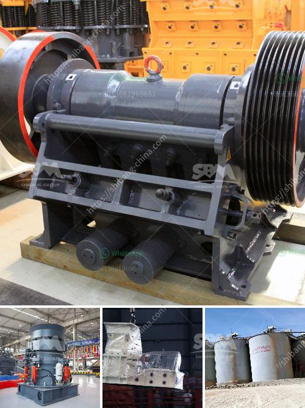

<h3>price of stone crusher capacitytons an hour</h3>
The stone crusher is a machine used to convert large stones into smaller sizes that can be used in construction or other purposes. There are several types of stone crushing machines, which are differentiated based on the stone processing stages, namely primary crusher, secondary crusher, and tertiary crusher. The price of a stone crusher with a capacity of tons per hour depends on many factors, including the nature of the stone, desired output size, and the specific components used.

1. Stone Nature: The hardness, size, and moisture content of the stones to be crushed play a crucial role in determining the type and size of the crusher required. Harder stones will require more energy and a higher capacity crusher, which will affect the cost.

2. Desired Output Size: Different construction projects require different sizes of crushed stones. Crushers come with different adjustable output sizes, and the machinery required for finer crushed stones will be more expensive compared to those for coarser stones.

3. Power and Components: The capacity of a stone crusher depends on its power source. Crushers can be powered by electricity, diesel engines, or even hydraulic systems. Each power source has its advantages and limitations, and the choice will impact the overall cost of the machine. Additionally, certain components, such as the wear-resistant lining and the material of the hammer, impact the durability and efficiency of the crusher, thereby affecting its price.

Generally, stone crushers used for heavy-duty construction work have higher prices compared to those used for smaller-scale projects or temporary purposes. A stone crusher with a capacity of tons per hour can cost between $15,000 and $60,000.

For example, a large fixed stone crusher with a feed size of 1000mm and a capacity of 500 tons per hour can reach 600-1000mm. The total investment cost of the machine can be as high as $2 million. The cost of a similar model with a smaller capacity will be significantly lower.

When purchasing a stone crusher, it is important to consider the stone nature, desired output size, power source, and components used. These factors directly impact the price of the machine. It is advisable to compare different options and consult with experts to ensure an optimal purchase. While high-capacity stone crushers may have a higher initial investment, they often offer better efficiency and productivity, making them suitable for large-scale construction projects and long-term use. Conversely, smaller crushers are cost-effective solutions for smaller projects with less demanding requirements. Ultimately, finding the right balance between price and performance is crucial to make an informed decision.
<h3>Contact us</h3><ul><li><strong>Whatsapp:&nbsp;<a href="https://wa.me/8613661969651">+8613661969651</a></strong></li><li><a href="https://swt.shibang-china.com/?git&amp;zhl&amp;price of stone crusher capacitytons an hour"><strong>Online Service(chat now)</strong></a></li></ul><h3>Related</h3><ul><li><a href='project proposal on stone crushing plant.md'>project proposal on stone crushing plant</a></li><li><a href='cone crusher company.md'>cone crusher company</a></li><li><a href='price list for belt conveyor pdf.md'>price list for belt conveyor pdf</a></li><li><a href='jaw crusher agen surabaya.md'>jaw crusher agen surabaya</a></li><li><a href='new crushing machine in south africa.md'>new crushing machine in south africa</a></li></ul>