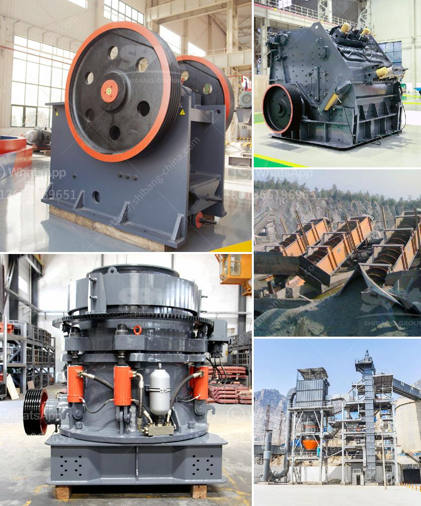

<h3>price on a mining ball mill 10 tons per hour</h3>
The mining industry heavily relies on advanced equipment to extract valuable minerals efficiently. One such crucial equipment for the mining process is the ball mill. Ball mills are used to grind and mill materials, ensuring the final product is fine and of high quality. 

The price of the ball mill varies with the specifications of the equipment. A standard ball mill for grinding mineral ore typically consists of a cylindrical drum mounted on a metallic frame fitted with replaceable liners. Depending on the application and liner materials, the drum's diameter and length can be adjusted accordingly. For instance, a ball mill for a mining operation may have a diameter of few meters, while a smaller ball mill may have a diameter of one meter or more. 

1. Capacity: The production capacity of a mining ball mill, defined in tons per hour, contributes significantly to its price. High-capacity mills require larger housings, more powerful motors, and increased processing capabilities, leading to a higher cost.

2. Construction Material: The materials used to construct the ball mill also influence its price. Steel and stainless steel drums are commonly used due to their durability, but they might be more expensive than alternative materials like rubber or ceramic.

3. Automation and Control Systems: Ball mills with advanced automation and control systems, such as digital monitoring and control, may be more expensive due to the additional technology and engineering involved.

4. Brand Reputation: The reputation and reliability of the manufacturer also play a vital role in determining the price. Established and reputable brands with proven track records may charge a premium price for their equipment.

5. Energy Efficiency: Rising energy costs have led to increased demand for energy-efficient ball mills. Mills with higher energy efficiency ratings tend to have higher upfront costs but provide significant savings in the long run.

The price of a mining ball mill is determined by multiple factors including capacity, construction material, automation, brand reputation, and energy efficiency. These factors collectively influence the upfront cost of the equipment. It is crucial for mining companies to assess their requirements and budget constraints while considering these factors to make an informed purchase decision. Consulting with manufacturers and experts in the mining industry can help in understanding the suitable options available and align them with specific operational requirements.
<h3>Contact us</h3><ul><li><strong>Whatsapp:&nbsp;<a href="https://wa.me/8613661969651">+8613661969651</a></strong></li><li><a href="https://swt.shibang-china.com/?git&amp;zhl&amp;price on a mining ball mill 10 tons per hour"><strong>Online Service(chat now)</strong></a></li></ul><h3>Related</h3><ul><li><a href='gold mining equipments manufacturers.md'>gold mining equipments manufacturers</a></li><li><a href='dealer of steel balls for ball mill in manila.md'>dealer of steel balls for ball mill in manila</a></li><li><a href='grinding media charge calculation in cement ball mills.md'>grinding media charge calculation in cement ball mills</a></li><li><a href='mobile gold processing 20 tph.md'>mobile gold processing 20 tph</a></li><li><a href='construction conveyor for sale.md'>construction conveyor for sale</a></li></ul>