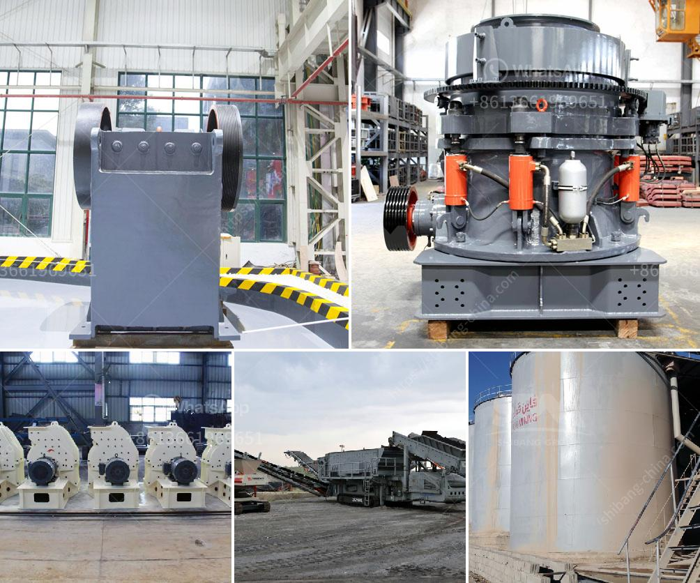

<h3>price rock crusher</h3>
Rock crushing machines are essential in the mining and construction industries where various types and sizes of rocks must be crushed to obtain the desired result. The price of a rock crusher will depend on the specific model you choose, but in general, the prices range from $45,000 to $100,000. Some of the best-selling models on the market include PE jaw crushers, PF impact crushers, and HX vertical shaft impact crushers.

PE jaw crushers are built with sturdy materials and feature a solid construction, making them highly durable. They are also known for their high crushing ratio, which allows them to crush large rocks into smaller sizes. These crushers can handle various materials, including soft rocks, hard rocks, and ores. The price range for PE jaw crushers is between $45,000 and $100,000.

PF impact crushers are designed to crush rocks and ores with a compressive strength of 300 MPa or lower. These crushers have a high crushing ratio, which means that they can efficiently crush materials into smaller sizes, reducing downtime for maintenance and improving overall productivity. The price range for PF impact crushers is between $45,000 and $100,000.

HX vertical shaft impact crushers are capable of crushing rocks into fine particles, making them suitable for producing high-quality aggregates and sand. These crushers utilize the principle of rock-on-rock collision, which results in better shaping of the final product. They are commonly used in the production of manufactured sand for the construction industry. The price range for HX vertical shaft impact crushers is between $50,000 and $100,000.

When considering the purchase of a rock crusher, it is essential to keep in mind that the price is just one factor to consider. Other factors, such as the quality of the machine, its reliability, and the level of after-sales support provided by the manufacturer, should also be taken into account. Investing in a high-quality rock crusher from a reputable manufacturer will ensure that you get the most value for your money and maximize your return on investment.

Another important aspect to consider is the operational cost of the rock crusher. This includes the cost of fuel, maintenance, repairs, and spare parts. It is advisable to choose a rock crusher that is energy efficient to reduce operational costs and minimize environmental impact.

In conclusion, the price of a rock crusher depends on several factors, including the specific model, its features, and the manufacturer. The prices range from $45,000 to $100,000, and the choice of a rock crusher should be made after considering the specific requirements of your project, as well as your budget and long-term goals. By investing in a high-quality rock crusher from a reputable manufacturer, you can ensure that you get the most value for your money and achieve the desired results in your mining or construction project.
<h3>Contact us</h3><ul><li><strong>Whatsapp:&nbsp;<a href="https://wa.me/8613661969651">+8613661969651</a></strong></li><li><a href="https://swt.shibang-china.com/?git&amp;zhl&amp;price rock crusher"><strong>Online Service(chat now)</strong></a></li></ul><h3>Related</h3><ul><li><a href='400 tph mobile coal crusher plant manufacturer.md'>400 tph mobile coal crusher plant manufacturer</a></li><li><a href='crusher production line.md'>crusher production line</a></li><li><a href='black stone crushing thailand.md'>black stone crushing thailand</a></li><li><a href='crush diabase machine.md'>crush diabase machine</a></li><li><a href='sand screw professional apr.md'>sand screw professional apr</a></li></ul>