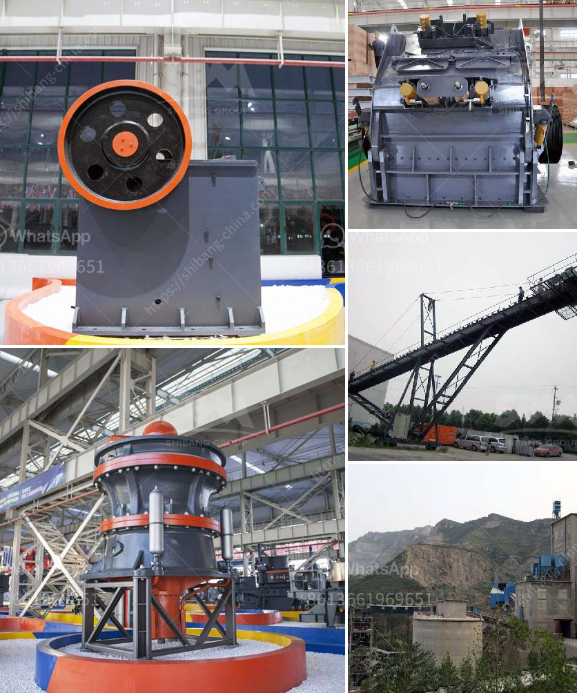

<h3>prices of complete crushing plant of baxter brand</h3>
The Baxter brand is well-known for its high-quality and reliable crushing plants that are widely used in various industries. When it comes to purchasing a complete crushing plant, the prices of Baxter brand equipment are often a major consideration for buyers.

The cost of a complete crushing plant of Baxter brand can vary depending on several factors. One of the primary factors that affect the price is the capacity of the plant. Baxter offers a range of crushing plants with different capacities, from smaller plants suitable for quarrying and recycling applications to larger plants designed for high-volume mining operations. As the capacity of the plant increases, so does the price.

Another important factor that influences the price of a Baxter crushing plant is the size and type of the equipment included. A complete crushing plant typically consists of several components, including a primary crusher, secondary crusher, vibrating screen, conveyor belts, and a control panel. The size and specifications of these components can vary based on the specific requirements of the customer. For instance, a plant designed for crushing hard rock will often require larger and more robust equipment, which can result in a higher price.

Additionally, the degree of automation and technological advancements incorporated into the crushing plant can affect the overall cost. Baxter offers cutting-edge features such as remote monitoring, intelligent control systems, and advanced automation options. While these technologies can enhance the efficiency and productivity of the plant, they can also increase the price tag.

Furthermore, the price of a complete crushing plant can be influenced by the location and infrastructure required for installation. If the plant needs to be transported over long distances or requires extensive groundwork and foundation construction, the associated costs can significantly impact the final price.

It is important to note that the prices of Baxter crushing plants can also vary depending on the specific market conditions and any additional customization requested by the customer. Baxter understands that each customer's needs are unique and offers the flexibility to cater to specific requirements. This can include modifications to the standard design or the inclusion of additional features to meet specific operational demands.

Overall, the prices of Baxter brand complete crushing plants can range from tens of thousands to millions of dollars, depending on capacity, equipment specifications, technological advancements, installation requirements, and customization options. It is advisable for potential buyers to contact Baxter directly for accurate and up-to-date pricing information based on their specific needs.

In conclusion, Baxter brand crushing plants are renowned for their quality and reliability. The prices of these plants can vary depending on factors such as capacity, equipment specifications, technological advancements, installation requirements, and customization options. By considering these factors, buyers can make informed decisions and invest in a crushing plant that suits their operational needs and budget.
<h3>Contact us</h3><ul><li><strong>Whatsapp:&nbsp;<a href="https://wa.me/8613661969651">+8613661969651</a></strong></li><li><a href="https://swt.shibang-china.com/?git&amp;zhl&amp;prices of complete crushing plant of baxter brand"><strong>Online Service(chat now)</strong></a></li></ul><h3>Related</h3><ul><li><a href='capacity of the jaw crusher.md'>capacity of the jaw crusher</a></li><li><a href='ballast crusher machine price.md'>ballast crusher machine price</a></li><li><a href='ball mill catalogue.md'>ball mill catalogue</a></li><li><a href='crushing and screening contractors in gauteng.md'>crushing and screening contractors in gauteng</a></li><li><a href='barangay resolution crushing plant.md'>barangay resolution crushing plant</a></li></ul>