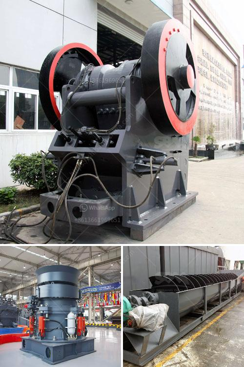

<h3>prices of conveyor belts for mining</h3>
Conveyor belts play a crucial role in the mining industry. They are used to transport bulk materials such as coal, ore, and minerals from one point to another within a mining operation. In order to maximize efficiency and productivity, it is important to choose the right conveyor belt system that is durable, reliable, and cost-effective. One important factor to consider when selecting a conveyor belt for mining is the price.

The price of conveyor belts for mining can vary greatly depending on the specific requirements and applications. There are a few key factors that can influence the price of a conveyor belt system, including the type of belt material, the size and capacity of the system, and any additional features or components.

Firstly, the type of belt material is an important consideration. Conveyor belts for mining are typically made from rubber, PVC, nylon, or steel. Each material has its own advantages and disadvantages, and the price can vary accordingly. Rubber belts are commonly used due to their durability and resistance to wear and tear. PVC belts are often cheaper than rubber belts but may not be as durable. Steel belts, on the other hand, are more expensive but offer exceptional durability and longevity.

Secondly, the size and capacity of the conveyor belt system can impact the price. Larger and higher-capacity systems require more materials and components, resulting in higher costs. Additionally, the length and width of the conveyor belt itself will also affect the price. Longer and wider belts will generally be more expensive than shorter and narrower ones.

Furthermore, additional features and components can also add to the price of a conveyor belt system. For instance, if the mining operation requires a conveyor belt that is resistant to heat or chemicals, a specialized belt with these properties may come at a higher cost. Other additional features, such as self-cleaning mechanisms or monitoring systems, can also increase the price of the system.

Overall, the price of conveyor belts for mining can range from a few thousand dollars to several hundred thousand dollars, depending on the specific requirements and applications. It is essential for mining companies to carefully evaluate their needs and budget in order to find a conveyor belt system that offers the best value for money.

It is worth noting that while cost is an important factor, it should not be the sole determining factor when choosing a conveyor belt system for mining. Quality, reliability, and durability are equally critical considerations. Investing in a high-quality conveyor belt system may initially be more expensive, but it can offer long-term cost savings by reducing maintenance and replacement costs.

In conclusion, the price of conveyor belts for mining can vary depending on multiple factors such as the type of belt material, the size and capacity of the system, and any additional features or components. Mining companies should carefully evaluate their needs and budget to find a conveyor belt system that offers the best value for money while also meeting the required quality and durability standards.
<h3>Contact us</h3><ul><li><strong>Whatsapp:&nbsp;<a href="https://wa.me/8613661969651">+8613661969651</a></strong></li><li><a href="https://swt.shibang-china.com/?git&amp;zhl&amp;prices of conveyor belts for mining"><strong>Online Service(chat now)</strong></a></li></ul><h3>Related</h3><ul><li><a href='quartz ball mill machinery.md'>quartz ball mill machinery</a></li><li><a href='mobile stone crusher gauteng.md'>mobile stone crusher gauteng</a></li><li><a href='limestone processing in nigeria.md'>limestone processing in nigeria</a></li><li><a href='ultrafine vertical roller mill.md'>ultrafine vertical roller mill</a></li><li><a href='gold washing plant tons per hour.md'>gold washing plant tons per hour</a></li></ul>