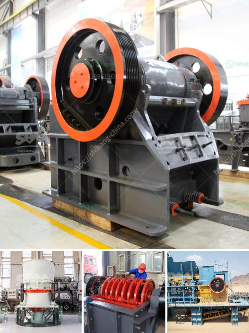

<h3>prices of crusher machine in pakistan</h3>
Crusher machines are used for crushing of stones, rocks, and other materials into smaller pieces. The major types of crushers available for mining operations include jaw crushers, cone crushers, gyratory crushers, and impact crushers. In recent years, crushers have become more affordable and accessible to businesses in Pakistan.

A crusher machine's average price ranges from $300 to $500. But, the cost depends on the quality, size, and brand of the machine. Some brands like Huawei and Oppo are relatively expensive as compared to other brands. Other brands offer similar functionality and efficiency at a lower price point. This price range makes crushers an affordable investment for construction businesses and mining companies in Pakistan.

The use of crusher machines has significantly improved construction projects in Pakistan. It has made the process of breaking down large rocks into smaller pieces more efficient and convenient. Crushers are vital equipment for many industries, including mining, agriculture, construction, and recycling. Different types of crushers have different features and are designed to serve different purposes.

Jaw crushers are commonly used for primary crushing. They are suitable for heavy-duty applications and have a high reduction ratio, which means they can effectively break down large rocks into smaller pieces. Jaw crushers are easy to operate and maintain, which makes them popular in the construction industry.

Cone crushers are ideal for secondary and tertiary crushing. They are capable of producing high-quality and well-shaped aggregates. Cone crushers are commonly used in the mining industry to crush hard rocks and ores effectively.

Gyratory crushers are suitable for primary crushing and can handle large rocks with a high capacity. They have a unique design with a concave surface and a conical head, which allows them to break down rocks efficiently.

Impact crushers are used for crushing stones and rocks with high hardness levels. They are suitable for processing materials with soft or medium hardness, such as limestone, dolomite, and gypsum. Impact crushers produce cubical-shaped materials, which are highly desired in the construction industry.

The price range of crusher machines in Pakistan is at a competitive level, with some crusher manufacturers offering their machines at incredibly low prices. In order to remain competitive, some manufacturers may reduce the price of their crushers in order to increase their market share.

It is important to consider the overall performance and quality of a crusher machine before making a purchase. Some machines may be priced lower but may not offer the same level of efficiency and durability. It is crucial to assess the technical specifications and features of a crusher machine before making a buying decision.

In conclusion, crusher machines are essential equipment in various industries, including mining, agriculture, construction, and recycling. The prices of these machines vary depending on their quality, size, and brand. A crusher machine can cost between $300 and $500, making it a relatively affordable investment for businesses in Pakistan. It is important to choose the right machine with the necessary features and performance to ensure efficient and effective crushing operations.
<h3>Contact us</h3><ul><li><strong>Whatsapp:&nbsp;<a href="https://wa.me/8613661969651">+8613661969651</a></strong></li><li><a href="https://swt.shibang-china.com/?git&amp;zhl&amp;prices of crusher machine in pakistan"><strong>Online Service(chat now)</strong></a></li></ul><h3>Related</h3><ul><li><a href='precipitated calcium carbonate plant in bangladesh.md'>precipitated calcium carbonate plant in bangladesh</a></li><li><a href='list of stone crusher plant in bangladesh.md'>list of stone crusher plant in bangladesh</a></li><li><a href='mobile crushers gravels.md'>mobile crushers gravels</a></li><li><a href='business plan for small scale chrome mining.md'>business plan for small scale chrome mining</a></li><li><a href='stone jaw crusher machinery supplier.md'>stone jaw crusher machinery supplier</a></li></ul>