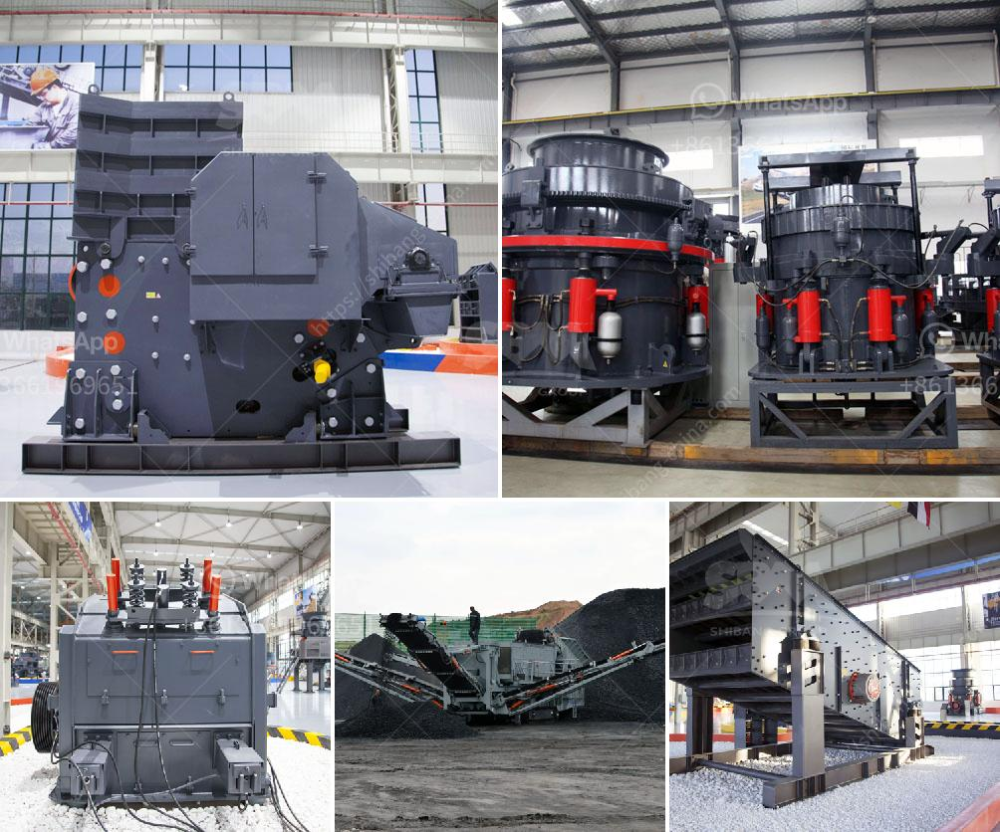

<h3>prices of granite crusher</h3>
Granite is one of the most commonly used materials for construction purposes due to its durability and aesthetic appeal. Whether it's used as a countertop in kitchens or as a surface for flooring, granite adds a touch of elegance to any space. As the demand for granite continues to rise, the prices of granite crusher have also witnessed a significant increase.

A granite crusher is a machine designed to break large rocks into smaller pieces or gravel. These machines are usually used in various construction projects or mining operations. The primary function of a granite crusher is to crush granite into different sizes of sand or gravel, which are essential materials used in construction.

When it comes to the prices of granite crushers, several factors contribute to their variation. The cost of a granite crusher primarily depends on its capacity, production efficiency, and the type of granite it crushes. Generally, granite crushers with higher capacities are priced higher due to their ability to process larger volumes of granite.

Another factor that affects the prices of granite crushers is the level of automation. Some crushers are manually operated, while others are fully automated. Fully automated machines tend to be more expensive as they require less human intervention, provide faster and more efficient outputs, and have additional features such as remote monitoring and control.

Furthermore, the type and quality of granite being crushed also affect the prices of granite crushers. There are different types of granite available, such as white granite, black granite, and brown granite. Premium quality granite is more expensive and, therefore, requires specialized crushers that can handle the hardness and density of the stone.

One should also consider additional costs associated with granite crushers. These costs include transportation, installation, and maintenance expenses. Transportation costs can vary depending on the distance between the manufacturer and the customer. Similarly, installation costs are influenced by the complexity and size of the crusher.

Maintenance costs, on the other hand, can significantly impact the overall cost of owning a granite crusher. Regular maintenance and repair are essential to ensure the longevity and optimal performance of the machine. Additionally, replacement parts and component expenses should also be taken into account when calculating the overall cost.

As for the current prices, granite crushers can range anywhere from $2,000 to $50,000 or even more. Small granite crushers with lower capacity and manual operation can be found in the lower price range. On the other hand, high-capacity, fully automated crushers that can handle larger volumes of granite tend to be more expensive.

It is crucial for consumers to conduct thorough research and compare prices from different manufacturers and suppliers before making a purchase. Additionally, considering the reputation and customer reviews of the manufacturer can help in determining the reliability and quality of the granite crusher.

In conclusion, the prices of granite crushers vary depending on several factors such as capacity, automation level, type of granite, and associated costs. While investing in a granite crusher can be a significant expense, it is a worthwhile investment for construction companies and mining operations. The durability and versatility of granite make it an excellent choice for various applications.
<h3>Contact us</h3><ul><li><strong>Whatsapp:&nbsp;<a href="https://wa.me/8613661969651">+8613661969651</a></strong></li><li><a href="https://swt.shibang-china.com/?git&amp;zhl&amp;prices of granite crusher"><strong>Online Service(chat now)</strong></a></li></ul><h3>Related</h3><ul><li><a href='basalt crushing equipment.md'>basalt crushing equipment</a></li><li><a href='stone crusher design philippines.md'>stone crusher design philippines</a></li><li><a href='aggregate jaw crushers saudi.md'>aggregate jaw crushers saudi</a></li><li><a href='mobile cone crusher hire malaysia.md'>mobile cone crusher hire malaysia</a></li><li><a href='beneficiation of iron ore suppliers.md'>beneficiation of iron ore suppliers</a></li></ul>