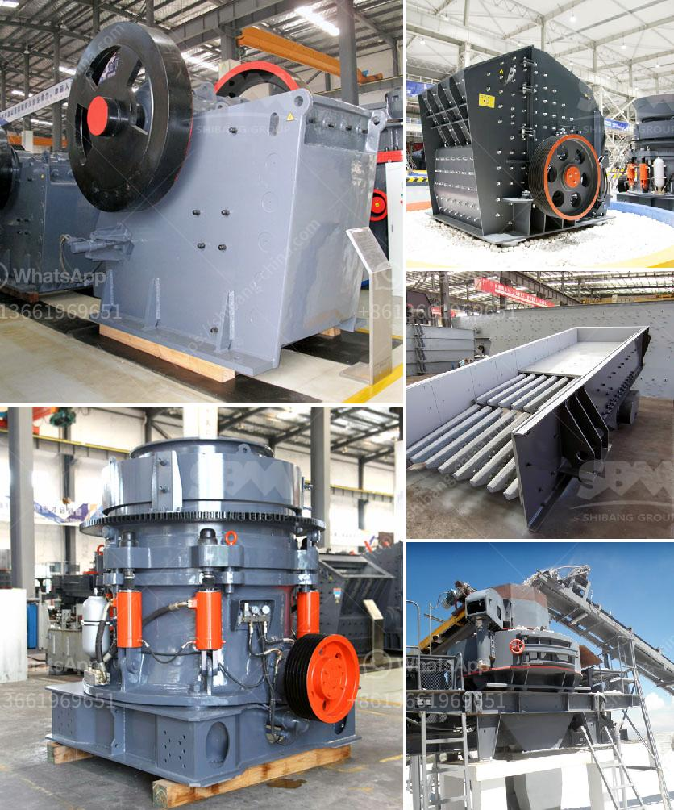

<h3>primary crusher pe 400x600 pm 15 single</h3>
The primary crusher PE 400x600 PM 15 Single is a reliable and efficient machine that is designed to crush and process various materials. With an input size of up to 400mm, this machine is capable of crushing materials such as limestone, granite, coal, and concrete. Its powerful 30 kW motor ensures high productivity, making it an ideal choice for crushing applications in the mining, quarrying, and construction industries.

One of the key features of the PE 400x600 PM 15 Single is its simple and compact design. This makes it easy to install and operate, even in tight spaces. The machine is also equipped with a hydraulic adjustment system, allowing for quick and easy changes to the desired output size. Additionally, the crusher is equipped with a dust suppression system, ensuring a clean and safe working environment.

The PE 400x600 PM 15 Single is known for its high crushing capacity. Its robust construction and durable components make it suitable for continuous use in demanding conditions. It is also designed to minimize downtime and reduce maintenance requirements, ensuring maximum uptime and productivity.

Furthermore, the PE 400x600 PM 15 Single is a cost-effective solution for crushing applications. Its energy-efficient motor reduces energy consumption, resulting in lower operating costs. Moreover, the machine's wear-resistant materials prolong its lifespan, reducing the need for frequent replacement of parts.

In conclusion, the primary crusher PE 400x600 PM 15 Single is a versatile and reliable machine that offers high productivity and efficient crushing capabilities. With its simple design, ease of operation, and low maintenance requirements, it is an excellent choice for various crushing applications. Whether in mining, quarrying, or construction, this crusher delivers consistent and high-quality results.
<h3>Contact us</h3><ul><li><strong>Whatsapp:&nbsp;<a href="https://wa.me/8613661969651">+8613661969651</a></strong></li><li><a href="https://swt.shibang-china.com/?git&amp;zhl&amp;primary crusher pe 400x600 pm 15 single"><strong>Online Service(chat now)</strong></a></li></ul><h3>Related</h3><ul><li><a href='iron crushing machine cost.md'>iron crushing machine cost</a></li><li><a href='quarry operations business plan.md'>quarry operations business plan</a></li><li><a href='used portable rock crusher for sale.md'>used portable rock crusher for sale</a></li><li><a href='cost of gold bow mill for sale in south africa.md'>cost of gold bow mill for sale in south africa</a></li><li><a href='ball mill for sale uk.md'>ball mill for sale uk</a></li></ul>