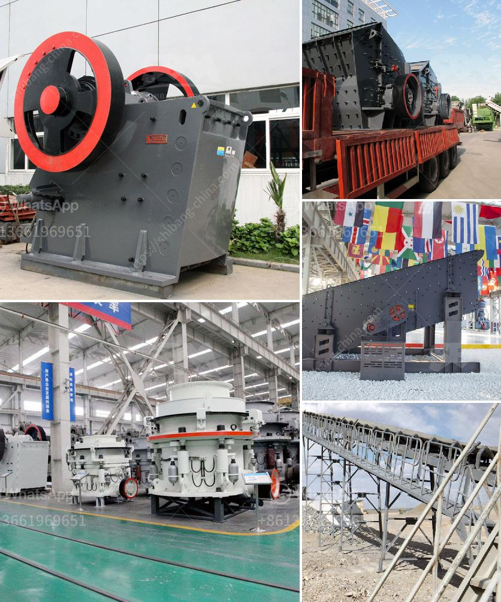

<h3>primary stone crusher for rent in karnataka</h3>
Primary stone crusher, as the name suggests, is a first stage crusher used to reduce the size of stones to smaller sizes. The product obtained after crushing is usually sharp-edged, with jagged edges, ranging from 0 to 2 inches. Primary stone crusher machinery widely used in highways, railways, mining and construction sectors for crushing hard materials in mining, building material, concrete and chemical industries.

The common crushing equipment is jaw crusher, impact crusher, cone crusher, hammer crusher, roller crusher, gyratory crusher, etc. These different crushers can be used for various purposes depending on the hardness and shape of the stones. Similarly, there are various types of crushers available in the market to choose from, such as portable crushers, specialized crushers, and static crushers.

In Karnataka, primary stone crusher for rent in India is popular. Rental services for crushing stones, limestones, basalt, coal, iron ore, rock (oreplus.in) Mobile Crusher Rental Services Portable stone crusher for production of aggregates and GSB and to be utilized for construction of Highways and Roads. The Mobile Stone Crushers can be installed at limited space near the stone quarry and can be operated with limited operators and staff.

Mobile Stone Crushers are capable of crushing basalt rock at the mines location and can be installed with stone quarry. The Crushers are well equipment with modern technology and are capable of crushing 100 tons per hour to 200 tons per hour depending upon hardness of the stone.

Primary stone crusher is the first stage in the crushing process. It is necessary equipment for processing stones into smaller sizes. Renting primary stone crusher will be advantageous for those individuals or companies that utilize stone on a regular basis. Whether you need to rent a primary crusher for a short period of time or a longer duration, you can easily find and book the right machine for your needs in Karnataka.
<h3>Contact us</h3><ul><li><strong>Whatsapp:&nbsp;<a href="https://wa.me/8613661969651">+8613661969651</a></strong></li><li><a href="https://swt.shibang-china.com/?git&amp;zhl&amp;primary stone crusher for rent in karnataka"><strong>Online Service(chat now)</strong></a></li></ul><h3>Related</h3><ul><li><a href='gypsum powder production process in india pdf.md'>gypsum powder production process in india pdf</a></li><li><a href='pfw series impact crusher.md'>pfw series impact crusher</a></li><li><a href='construction conveyor for sale.md'>construction conveyor for sale</a></li><li><a href='kaolin mining processing indonesia.md'>kaolin mining processing indonesia</a></li><li><a href='copper ore concentration plant supplier.md'>copper ore concentration plant supplier</a></li></ul>