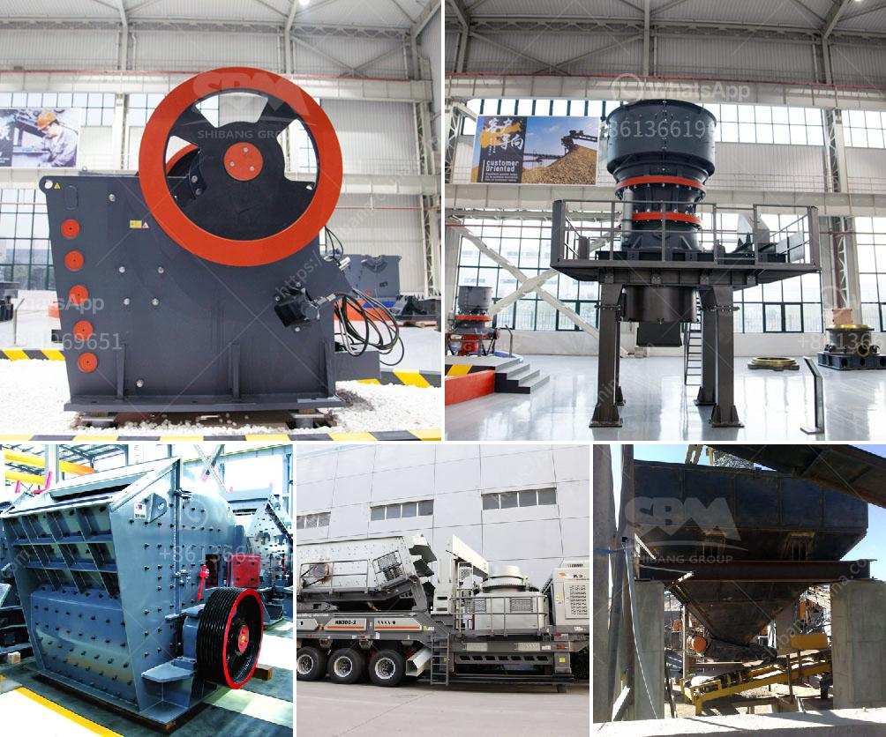

<h3>print hammer mill</h3>
Comminution is a vital process in many industries, such as mining, petroleum, food processing, pharmaceutical, and recycling. It involves reducing the particle size of materials to facilitate further processing or enhance their properties. One popular and efficient equipment for comminution is the print hammer mill.

The print hammer mill is a mechanical device that is used to crush and pulverize bulky materials into fine particles. It consists of a rotor which rotates at high speed inside a metal casing. The rotor contains several hammers, which strike the materials as they pass through the machine, causing them to break into smaller pieces.

One of the key advantages of the print hammer mill is its versatility. It can handle a wide variety of materials, including coal, limestone, gypsum, ores, and agricultural products. This makes it suitable for use in multiple industries. Whether it's reducing coal to be used in power plants or preparing agricultural products for animal feed, the print hammer mill can efficiently and effectively process them all.

A crucial feature of the print hammer mill is its ability to control the particle size of the output. By adjusting the size of the gaps between the hammers and the casing, operators can control the size of the crushed particles. This is important as different industries require different particle sizes for their respective applications. For example, in the pharmaceutical industry, fine particles are often required for drug formulations, while larger particles may be needed for certain chemical reactions.

In addition to its versatility and particle size control, the print hammer mill also offers several other benefits. One of them is its energy efficiency. The machine is designed to minimize energy consumption while still maintaining high levels of production. This helps businesses reduce their operating costs and improve their overall sustainability.

Furthermore, the print hammer mill is relatively easy to operate and maintain. It has a simple design, which means fewer components that can malfunction or require maintenance. This results in less downtime and increased productivity for businesses.

Lastly, the print hammer mill is cost-effective. Its initial investment cost is relatively low compared to other comminution equipment. Additionally, its high production capacity and efficiency allow businesses to process large quantities of materials in a shorter amount of time, further enhancing their profitability.

In conclusion, the print hammer mill is a versatile and efficient machine for comminution. It can handle a wide variety of materials and offers excellent control over the particle size of the output. Moreover, it is energy-efficient, easy to operate and maintain, and cost-effective. These qualities make it an indispensable tool for numerous industries, where the reduction of bulk materials is key to their operations. As technology continues to evolve, the print hammer mill will likely undergo further advancements, ensuring its continued relevance and usefulness in the comminution industry.
<h3>Contact us</h3><ul><li><strong>Whatsapp:&nbsp;<a href="https://wa.me/8613661969651">+8613661969651</a></strong></li><li><a href="https://swt.shibang-china.com/?git&amp;zhl&amp;print hammer mill"><strong>Online Service(chat now)</strong></a></li></ul><h3>Related</h3><ul><li><a href='conveyor belt user in tanzania.md'>conveyor belt user in tanzania</a></li><li><a href='stone quarrys crusher in ghana.md'>stone quarrys crusher in ghana</a></li><li><a href='sale of stone hammer hammer.md'>sale of stone hammer hammer</a></li><li><a href='ball mill catalogue.md'>ball mill catalogue</a></li><li><a href='coal screening machine for sale south africa.md'>coal screening machine for sale south africa</a></li></ul>