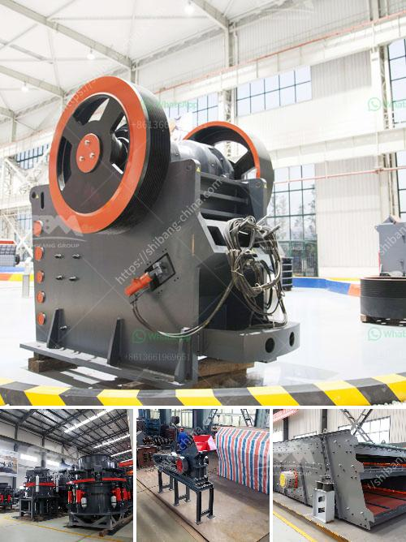

<h3>process of granite mining crusher machines used</h3>
Granite is an igneous rock formed underground by the cooling of magma, which is the molten rock material found in the earth's crust. Granite is a hard, durable rock that is often used in construction as building material and aggregate for road construction. One of the most common methods used to mine granite is by employing heavy machinery to extract the rock from the ground.

The first step in the granite mining process is to remove the overlying soil and waste rock. This material, often referred to as "overburden," is typically stockpiled nearby for future reclamation of the site after the extraction process is complete. Once the overburden is removed, the granite is exposed and ready to be extracted.

The next step in the process involves drilling holes into the granite using specialized drilling machines. These holes are spaced apart and are used to insert explosive charges into the rock. The explosive charges are then detonated, breaking the granite into smaller pieces. This process, known as "blasting," allows for the extraction of large blocks of granite from the quarry.

Once the granite has been broken into smaller pieces, it is then loaded onto trucks or conveyors for transport to a crushing plant. At the crushing plant, the granite is processed into smaller pieces using a primary jaw crusher. This primary crusher reduces the size of the granite from boulder-sized to approximately 5-7 inches in diameter.

After the primary crushing, the smaller granite pieces are fed into a secondary cone crusher for further size reduction. This secondary crushing process reduces the granite to a more manageable size, typically ranging from 1-2 inches to 3/4 of an inch.

Once the granite has been crushed, it is screened to remove any unwanted particles or impurities. The screeners separate the granite into different sizes based on the desired end product. The screened granite is then conveyed to storage piles for further processing or loading onto trucks for transport to customers.

The final step in the granite mining process involves the sale and delivery of the finished product to customers. Once the granite has been processed into the desired sizes and quality, it is typically sold to contractors, builders, and other construction companies. The granite may be used for a variety of purposes, including the construction of buildings, roads, bridges, and monuments.

In conclusion, the process of granite mining involves the removal of overburden, drilling, blasting, crushing, screening, and the sale and delivery of the finished product. Each step in the process requires specialized machinery and equipment to ensure quality and efficiency. With the use of these machines, granite mining can be performed efficiently, allowing for the extraction and processing of this valuable natural resource.
<h3>Contact us</h3><ul><li><strong>Whatsapp:&nbsp;<a href="https://wa.me/8613661969651">+8613661969651</a></strong></li><li><a href="https://swt.shibang-china.com/?git&amp;zhl&amp;process of granite mining crusher machines used"><strong>Online Service(chat now)</strong></a></li></ul><h3>Related</h3><ul><li><a href='feldspar grinding in raymond mill.md'>feldspar grinding in raymond mill</a></li><li><a href='gemstone washing machine in china.md'>gemstone washing machine in china</a></li><li><a href='prices of granite crusher.md'>prices of granite crusher</a></li><li><a href='black stone crushing thailand.md'>black stone crushing thailand</a></li><li><a href='stone crusher quote list.md'>stone crusher quote list</a></li></ul>