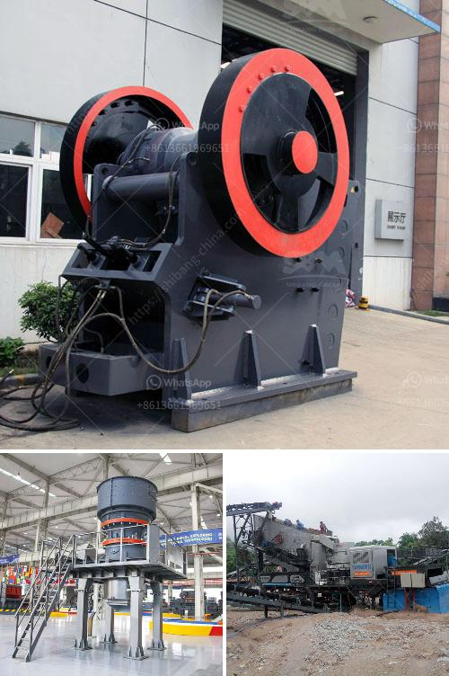

<h3>process of gypsum board manufacturing</h3>
Gypsum board, also known as drywall or plasterboard, is a common and widely used building material. It is primarily composed of gypsum, which is a soft sulfate mineral. The manufacturing process of gypsum board involves several steps and can be briefly outlined as follows:

The first step in the manufacturing process of gypsum board entails the extraction of gypsum ore from mines or quarries. This process involves drilling, blasting, crushing, and transportation of the blasted ore to the crushing plant, where large rocks are reduced in size using crushers.

Once the gypsum ore is transported to the crushing plant, it undergoes a series of crushing and grinding processes to reduce the size of the ore to a more manageable level. The crushed gypsum is then conveyed to a ball mill, where it is ground to a powder consistency.

The ground gypsum is heated in a rotary kiln at high temperatures (around 150 degrees Celsius). This process, known as calcination, removes any remaining water molecules from the gypsum, transforming it into a dry, powder-like substance called calcined gypsum or stucco.

The calcined gypsum is carefully mixed with additives and water in a mixing machine to create a slurry or paste. This slurry is then poured onto a continuous sheet of paper, which acts as a facing material for the finished gypsum board. Another layer of paper is added on top of the slurry to complete the sandwiched structure.

After the slurry is poured onto the paper, it passes through forming tables equipped with various mechanisms to shape and flatten the slurry into a continuous board. It is during this step that the edges of the board are formed to create a tapered edge or squared edge. The formed board then proceeds through a series of rollers, which press it to ensure even thickness and to remove excess water.

Once the gypsum board has been formed and pressed, it is transferred to a drying chamber where it is subjected to heat to remove moisture and accelerate the drying process. The drying time can vary but typically lasts around 20-30 minutes. After drying, the board is cut to desired dimensions and conveyed to a kiln for final curing.

Once cured, the gypsum boards are inspected for any defects and undergo a finishing process to smooth out any imperfections. This may involve sanding, trimming, and applying a primer or paint if desired. The finished boards are then packaged and prepared for distribution and sale.

In conclusion, the process of gypsum board manufacturing involves the extraction and crushing of gypsum ore, followed by calcination, mixing, forming, pressing, drying, and ultimately finishing and packaging. This versatile construction material has become an integral part of the building industry due to its fire resistance, soundproofing qualities, and ease of installation.
<h3>Contact us</h3><ul><li><strong>Whatsapp:&nbsp;<a href="https://wa.me/8613661969651">+8613661969651</a></strong></li><li><a href="https://swt.shibang-china.com/?git&amp;zhl&amp;process of gypsum board manufacturing"><strong>Online Service(chat now)</strong></a></li></ul><h3>Related</h3><ul><li><a href='distributor jaw crusher merk khong chuan.md'>distributor jaw crusher merk khong chuan</a></li><li><a href='cone crusher plant for sale.md'>cone crusher plant for sale</a></li><li><a href='silica quartz crusher processing.md'>silica quartz crusher processing</a></li><li><a href='captains of crusher zenith.md'>captains of crusher zenith</a></li><li><a href='alluvial gold washing plant in zimbabwe.md'>alluvial gold washing plant in zimbabwe</a></li></ul>