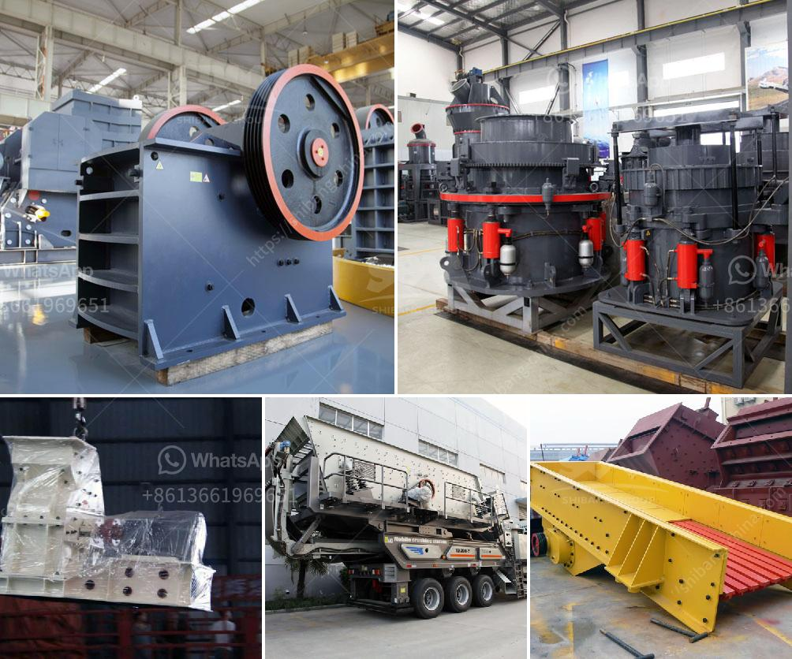

<h3>process of making methanol from coal</h3>
Methanol is a versatile and widely used chemical compound that serves as an essential building block for various industrial applications. While traditionally derived from natural gas or biomass, recent advancements have explored alternative methods of producing methanol, with coal emerging as a valuable resource in this regard. The process of making methanol from coal involves several key steps, unlocking a potential new source of this valuable chemical.

The first step in producing methanol from coal is coal gasification. This process involves subjecting coal to high temperatures and controlled amounts of oxygen, resulting in the production of a combustible gas known as syngas. Syngas is a mixture of carbon monoxide (CO), hydrogen (H2), and various impurities. It is this syngas that serves as the primary raw material in the production of methanol.

The next step involves converting syngas into crude methanol using a catalytic process. The key catalyst used in this conversion is copper-based, as it facilitates the desired chemical reactions effectively. The conversion process ensures that the CO and H2 present in syngas react to form methanol (CH3OH). Although initially, crude methanol is obtained, additional refining and purification steps are required to ensure the final product meets the desired quality specifications.

The final stage involves refining and purifying the crude methanol. This includes processes such as distillation, where the mixture is heated, and the various components are separated based on their boiling points. Fractional distillation is commonly used in this stage, allowing the recovery of high-purity methanol.

The production of methanol from coal presents several advantages. Firstly, it offers an alternative source of methanol production, reducing dependency on natural gas or biomass. Utilizing coal reserves not only ensures diversification but also taps into an abundant and widely available resource. Additionally, methanol derived from coal can reduce greenhouse gas emissions, as coal gasification can be paired with carbon capture and storage technologies, mitigating the environmental impact.

While the process of making methanol from coal is in its nascent stages, ongoing research and technological advancements continue to optimize and refine the process. This promising pathway has caught the attention of stakeholders worldwide, including governments, energy companies, and researchers, seeking to leverage coal's potential for a sustainable and economically viable methanol production method.

In conclusion, the process of making methanol from coal involves coal gasification, conversion of syngas into crude methanol using a copper-based catalyst, and subsequent refining and purification steps. With its potential to diversify methanol sources and reduce environmental impact, this innovative process may pave the way for a cleaner and more sustainable future in the methanol industry.
<h3>Contact us</h3><ul><li><strong>Whatsapp:&nbsp;<a href="https://wa.me/8613661969651">+8613661969651</a></strong></li><li><a href="https://swt.shibang-china.com/?git&amp;zhl&amp;process of making methanol from coal"><strong>Online Service(chat now)</strong></a></li></ul><h3>Related</h3><ul><li><a href='grinding mill for limestone italy in bergamo.md'>grinding mill for limestone italy in bergamo</a></li><li><a href='belt conveyor manufacturers in indonesia.md'>belt conveyor manufacturers in indonesia</a></li><li><a href='alluvia gold mining equipments.md'>alluvia gold mining equipments</a></li><li><a href='industrial ball mill for sale.md'>industrial ball mill for sale</a></li><li><a href='quartz stone heating machine for sale.md'>quartz stone heating machine for sale</a></li></ul>