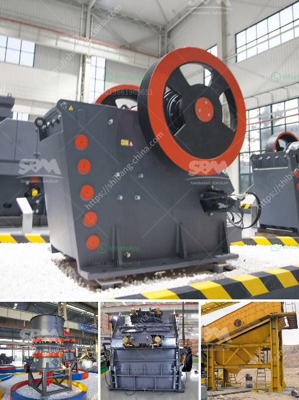

<h3>process of quarrying limestone crusher</h3>
Quarrying limestone is the process of removing this material from the ground. As with any quarrying process, there are certain pros and cons that must be evaluated. List of the Pros of Quarrying Limestone 1. It can be an economic engine. Quarries can provide numerous jobs at the local level. People can work at the quarry to extract the limestone that is needed. Drivers are needed to transport the limestone to where it will be processed or used. Processing facilities hire handlers to create usable products from the delivered materials. Local service industries are needed to support these workers. 2. It is often in high demand. The market for limestone aggregates can be large, which means that the scale of quarrying operations can be immense. If there is a market for it, miners will seek to extract the material from the ground. In some situations, limestone is used for glass making. Fine ground limestone is used in products such as fillers in paint and adhesives. Calcium carbonate, derived from limestone, is used in agricultural products, and household items including toothpaste and paint. 3. It is a highly valuable resource. Quarrying limestone creates jobs since limestone is so widely used and an important resource, it is readily available and readily consumed. The working conditions are safer than underground mining and quarrying is typically done close to a market, transportation costs can be expensive if the stone must be transported over long distances. By using locally available resources, communities minimize the environmental impact of transportation. 

1. They can permanently disfigure the environment. Many limestone quarries can be seen from a great distance away. In many cases, the quarrying work creates changes to the natural landscape that cannot be repaired. That means once the quarry has been established, it often becomes a permanent part of that community, even if it is not being used. Quarries are known to cause sinkholes, damage groundwater tables, and increase the risks of experiencing soil erosion, even when managed properly. 2. Quarries create difficult traffic patterns. Limestone quarries may create jobs, but they also create costs. Traffic can be a major problem for small communities near a quarry. There may be infrastructure costs required to support the quarry before it can begin operations. Noise pollution, traffic exhaust, and other related traffic problems become part of the experience as well. 3. They can have a negative impact on wildlife habitats. Quarries are often thought of as a bad thing since they disrupt natural habitats, but they do provide some benefits that are vital to humanity. The limestone that is quarried is used to build roads, bridges, homes, and other infrastructure where it is needed. However, habitat modification and destruction may be irreversible if not managed carefully. This increases the potential for plant and animal life to use the quarried area as a refuge. If native habitats are not available, then new habitats must be created, either by planting vegetation or by relocating threatened species.  By recognizing this information, you can see that quarrying is an alarming human activity that can forever transform and destroy local ecosystems. Therefore, it is crucial that we find ways to minimize the negative effects and promote the sustainable use of limestone. Through careful planning and execution, we can ensure that limestone quarrying operations have a minimal impact on the environment while still supporting local communities and their economic growth.
<h3>Contact us</h3><ul><li><strong>Whatsapp:&nbsp;<a href="https://wa.me/8613661969651">+8613661969651</a></strong></li><li><a href="https://swt.shibang-china.com/?git&amp;zhl&amp;process of quarrying limestone crusher"><strong>Online Service(chat now)</strong></a></li></ul><h3>Related</h3><ul><li><a href='kaolin processing line.md'>kaolin processing line</a></li><li><a href='limestone mines for sale in cambodia.md'>limestone mines for sale in cambodia</a></li><li><a href='how much does gold ore cost.md'>how much does gold ore cost</a></li><li><a href='impact crusher zenith.md'>impact crusher zenith</a></li><li><a href='cement plant layout pdf.md'>cement plant layout pdf</a></li></ul>