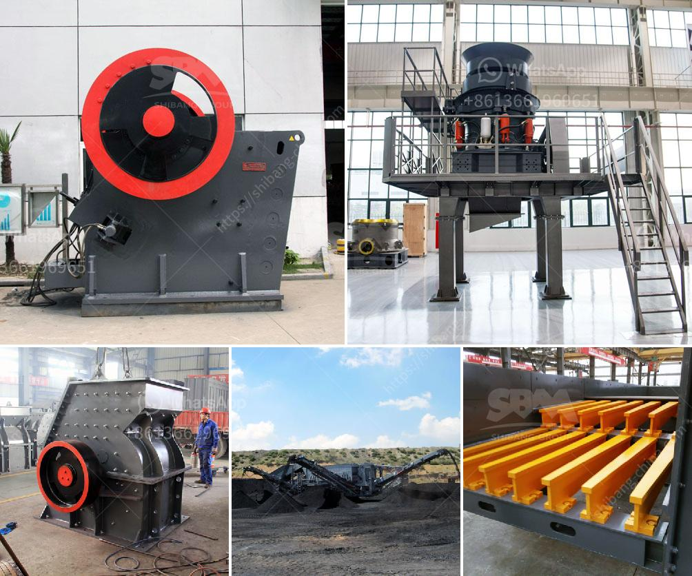

<h3>processing of bauxite ore</h3>
The aluminum industry is one of the most significant industrial sectors globally, and it relies heavily on the processing of bauxite ore for its production. Bauxite ore is the primary source of aluminum metal, used in everything from aircraft fuselages to kitchen utensils. This article explores the processing of bauxite ore, highlighting its critical role in the aluminum industry.

Bauxite ore is typically found in tropical or subtropical regions, mainly in Africa, Australia, and South America. It is formed by weathering of aluminum-rich rocks over millions of years. The primary mineral in bauxite ore is gibbsite, which is an aluminum hydroxide (Al(OH)3). Other minerals, such as boehmite and diaspore, also contribute to the bauxite composition.

The processing of bauxite ore aims to extract pure aluminum oxide, also known as alumina, which is then transformed into aluminum metal through various electrolytic processes. Several steps are involved in the processing of bauxite ore, starting with its excavation from open-pit mines.

Once bauxite ore is mined, it is transported to a nearby refinery for further processing. The mining and transportation processes involve heavy machinery and significant energy consumption. To minimize environmental impact, modern mining techniques aim to restore the land to its original state once the mining operations have been completed.

At the refinery, bauxite ore undergoes a series of chemical and physical treatments to obtain pure alumina. The ore is crushed and ground into fine particles, allowing for better extraction efficiency. This process, known as the Bayer process, was developed in 1888 by Austrian chemist Karl Bayer and has since become the primary method for alumina extraction.

In the Bayer process, the crushed bauxite ore is mixed with a hot caustic soda solution, which dissolves alumina from the ore while leaving impurities behind. The resulting slurry is transferred to a series of settling tanks, where solid impurities settle at the bottom while a clear alumina-rich solution is decanted.

The clear solution, also known as the pregnant liquor, is then sent through a precipitation stage, where alumina is recovered as a crystalline product. This involves the addition of seed crystals, which act as nuclei for the precipitation of alumina particles. The resulting mixture is heated, causing alumina crystals to form.

The alumina crystals are then washed, filtered, and calcined to remove any remaining impurities. Calcination involves heating the alumina at high temperatures, which removes the water of hydration and transforms the alumina into a crystalline form suitable for further processing.

The final product of this process is pure alumina, which can be further refined to produce aluminum metal. Depending on the desired end use, alumina may undergo additional purification steps to meet specific quality requirements imposed by various industries.

In conclusion, the processing of bauxite ore plays a vital role in the aluminum industry. Through the Bayer process, bauxite ore is extracted, and pure alumina is obtained, which is then transformed into aluminum metal. This process involves multiple steps, such as mining, crushing, grinding, and chemical treatments. Efforts have been made to minimize environmental impact, and the industry continues to innovate and improve its processing techniques to meet growing global demands for aluminum.
<h3>Contact us</h3><ul><li><strong>Whatsapp:&nbsp;<a href="https://wa.me/8613661969651">+8613661969651</a></strong></li><li><a href="https://swt.shibang-china.com/?git&amp;zhl&amp;processing of bauxite ore"><strong>Online Service(chat now)</strong></a></li></ul><h3>Related</h3><ul><li><a href='project report for establishing stone crusher.md'>project report for establishing stone crusher</a></li><li><a href='jaw crusher adaptable extec coal russian.md'>jaw crusher adaptable extec coal russian</a></li><li><a href='rollers for conveyor belts manizales.md'>rollers for conveyor belts manizales</a></li><li><a href='price rock crusher.md'>price rock crusher</a></li><li><a href='stone crusher for sale in usa.md'>stone crusher for sale in usa</a></li></ul>