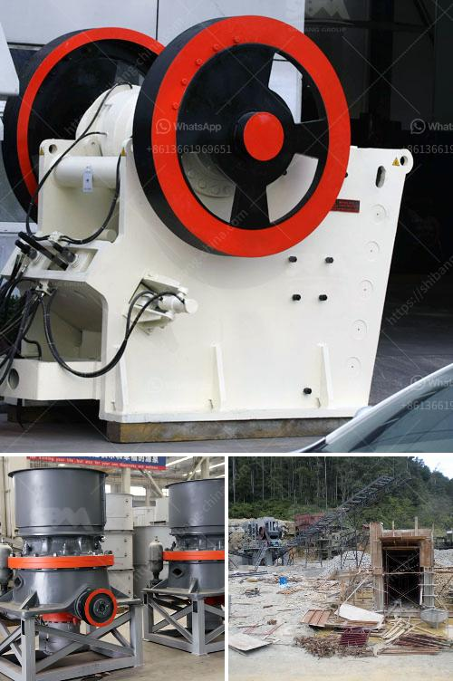

<h3>processing of copper crusher in zambia</h3>
The copper ore processing in Zambia has been one of the main sources of revenue for the country. Copper plays a vital role in the economic development of Zambia, and the copper mining industry plays a crucial role in the development of the country. With the continuous expansion of copper mines in Zambia, there has been an increasing demand for copper ore.

The copper ore processing in Zambia involves crushing, grinding, flotation, and gravity separation. According to the properties of the minerals in the copper ore, the copper concentrate can be obtained through crushing and grinding, and then using the flotation method to separate the copper concentrate from the gangue minerals. Gravity separation can also be used to separate the copper concentrate from the gangue minerals.

The processing of copper ore involves crushing the ore into small particles. These small particles are then ground into a fine powder using a ball mill or other grinding equipment. The resulting particles are mixed with water to create a slurry and then sent to a flotation cell. In the flotation cell, chemicals are added to the slurry to separate the copper concentrate from the gangue minerals. The copper concentrate is then filtered and dried to obtain the final copper concentrate.

In the copper ore processing plant, the crushing process is the first stage. The crushing equipment and grinding equipment are the key equipment for the copper ore processing in Zambia. As we all know, copper ore can be turned into high-grade copper concentrate through the crushing and grinding process. To obtain the copper concentrate, it is necessary to crush and grind the copper ore to the appropriate size.

The processing of copper ore in Zambia also involves flotation. Flotation is the most commonly used method for separating copper concentrate from gangue minerals. In the flotation process, chemicals and air bubbles are added to the slurry to make the copper minerals attach to the air bubbles and float to the surface. The gangue minerals sink to the bottom of the flotation cell and are discharged as tailings.

After the flotation process, the copper concentrate is filtered to remove excess water and then dried. The dried copper concentrate is then transported to a smelter or refinery for further processing. At the smelter or refinery, the copper concentrate is heated and melted to remove impurities and obtain pure copper metal.

The processing of copper ore in Zambia is crucial for the economic development of the country. The copper mining industry provides job opportunities for thousands of people and contributes significantly to the country's GDP. In recent years, the government of Zambia has been focusing on promoting the development of the copper mining industry and attracting more investment in the sector. With the continuous improvement of copper ore processing technology and the increase in copper prices, the processing of copper ore in Zambia is expected to bring more benefits to the country's economy.

In conclusion, the processing of copper ore in Zambia involves crushing, grinding, flotation, and gravity separation. These processes are essential for obtaining high-grade copper concentrate for further processing. The copper mining industry plays a vital role in the economic development of Zambia, and the continuous improvement of copper ore processing technology will further promote the development of the industry.
<h3>Contact us</h3><ul><li><strong>Whatsapp:&nbsp;<a href="https://wa.me/8613661969651">+8613661969651</a></strong></li><li><a href="https://swt.shibang-china.com/?git&amp;zhl&amp;processing of copper crusher in zambia"><strong>Online Service(chat now)</strong></a></li></ul><h3>Related</h3><ul><li><a href='mini jaw crusher saudi.md'>mini jaw crusher saudi</a></li><li><a href='2 micron limestone grinding unit in india.md'>2 micron limestone grinding unit in india</a></li><li><a href='coal crusher size 100 tph.md'>coal crusher size 100 tph</a></li><li><a href='project cost of tpd ofcement plant in pakistan.md'>project cost of tpd ofcement plant in pakistan</a></li><li><a href='slag crusher manufacturer.md'>slag crusher manufacturer</a></li></ul>