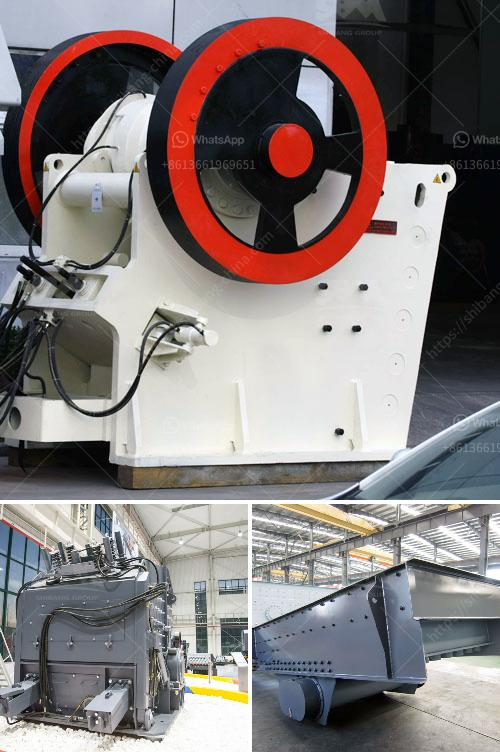

<h3>product japan crushing plant</h3>
Japan, known for its technological prowess, has a strong industrial sector that includes the manufacturing of various products. One notable industry is the construction and mining sector, which relies heavily on crushing plants. A crushing plant is a machine designed to reduce large rocks into smaller rocks, gravel, or rock dust, ensuring efficient crushing of materials for various applications.

In Japan, crushing plants are a popular and integral part of many industrial activities. They operate in various sites such as mining, quarrying, road construction, demolition, and recycling. Crushing plants are specially designed for accurate and efficient crushing of diverse materials, such as stones, rocks, and aggregates, ensuring consistent end products with minimal waste.

One of the key manufacturers in Japan in the crushing plant industry is Komatsu, which offers a wide range of crushing plants suitable for both small-scale and large-scale operations. These plants are equipped with advanced technology and robust components to ensure reliable performance, maximum productivity, and low maintenance requirements.

Japan's crushing plants are designed to meet the demanding needs of diverse industries, providing flexibility and adaptability in various working environments. With features such as mobility, compactness, and ease of operation, these plants are optimal for on-site crushing and processing, reducing the need for transportation and logistics.

Moreover, Japan's crushing plants incorporate innovative technology to enhance efficiency and reduce environmental impact. For instance, some plants are equipped with dust suppression systems to minimize dust emissions during the crushing process, promoting a healthier and safer working environment for operators.

Overall, Japan's crushing plant industry plays a crucial role in supporting the construction and mining sectors. These plants efficiently transform raw materials into valuable products, contributing to the development of infrastructure projects and the sustainable use of resources. With continuous advancements in technology and a commitment to environmental stewardship, Japan's crushing plants are likely to remain at the forefront of innovation in the industry.
<h3>Contact us</h3><ul><li><strong>Whatsapp:&nbsp;<a href="https://wa.me/8613661969651">+8613661969651</a></strong></li><li><a href="https://swt.shibang-china.com/?git&amp;zhl&amp;product japan crushing plant"><strong>Online Service(chat now)</strong></a></li></ul><h3>Related</h3><ul><li><a href='coal crushing machine.md'>coal crushing machine</a></li><li><a href='the cost of stone crusher in pakistan.md'>the cost of stone crusher in pakistan</a></li><li><a href='roller mill for dolmite.md'>roller mill for dolmite</a></li><li><a href='ball mill manufacturers in gujarat.md'>ball mill manufacturers in gujarat</a></li><li><a href='diatomite processing plant.md'>diatomite processing plant</a></li></ul>