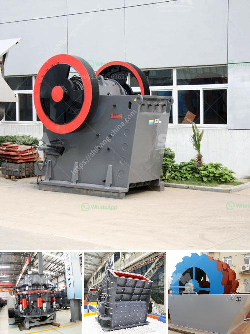

<h3>production of cement mill in africa</h3>
The production of cement in Africa has been booming in recent years. With an ever-increasing demand for construction materials, countries in Africa have been investing heavily in the expansion and modernization of their cement industries. One of the key components in this process is the cement mill.

A cement mill is the equipment used to grind the hard, nodular clinker from the cement kiln into the fine grey powder that is cement. Most cement is currently ground in ball mills and also vertical roller mills which are more effective than ball mills.

Several factors contribute to the growing production of cement mills in Africa. Firstly, the population in Africa is expanding rapidly, leading to a surge in construction activities. As the construction sector booms, so does the demand for cement. To meet this rising demand, cement companies need to increase their production capacity, which requires more cement mills.

Secondly, urbanization is taking place at an unprecedented rate in many African countries. Rapid urbanization means more cities are being built, along with residential and commercial buildings. This has resulted in a higher demand for cement, particularly in Africa's major cities. Cement mills play a crucial role in meeting this demand by grinding the clinker into the required fineness.

Moreover, the African governments have also recognized the importance of infrastructure development to support economic growth. Many large-scale infrastructure projects, such as roads, bridges, airports, and dams, are being undertaken in Africa. These projects require a significant amount of cement, and thus, cement mills are essential to their success.

The production of cement mills in Africa has seen significant investments from both local and international companies. International cement manufacturers are attracted to Africa's growing market and are establishing their presence by building new cement mills. This not only helps meet the increasing demand but also contributes to job creation and economic growth.

Local cement companies are also expanding their production capacities by investing in new cement mills. These investments improve the efficiency and quality of cement production in Africa. With modern equipment and advanced technology, cement mills in Africa are becoming more sustainable and eco-friendly.

However, challenges still persist in the production of cement mills in Africa. One of the significant hurdles is the availability of raw materials. Cement production requires limestone, clay, and other minerals, which are not always abundant in Africa. This drives up the cost of production and makes it more challenging for cement mills to compete internationally.

Another challenge is the lack of reliable and affordable energy supply. Many countries in Africa face frequent power outages, which hampers the smooth operation of cement mills. Companies have to invest in backup generators or rely on expensive alternative energy sources, adding to the production costs.

In conclusion, the production of cement mills in Africa has been on the rise due to the increasing demand for cement driven by population growth, urbanization, and infrastructure development. Investments from local and international companies have boosted the capacity and efficiency of cement production. However, challenges related to raw materials and energy supply need to be addressed to ensure the long-term sustainability of the cement industry in Africa.
<h3>Contact us</h3><ul><li><strong>Whatsapp:&nbsp;<a href="https://wa.me/8613661969651">+8613661969651</a></strong></li><li><a href="https://swt.shibang-china.com/?git&amp;zhl&amp;production of cement mill in africa"><strong>Online Service(chat now)</strong></a></li></ul><h3>Related</h3><ul><li><a href='quartz stone crushing machine for stone industries.md'>quartz stone crushing machine for stone industries</a></li><li><a href='conveyor belt capacity.md'>conveyor belt capacity</a></li><li><a href='vibration grinding equipment.md'>vibration grinding equipment</a></li><li><a href='stone quarry plant.md'>stone quarry plant</a></li><li><a href='mining of granite companies.md'>mining of granite companies</a></li></ul>