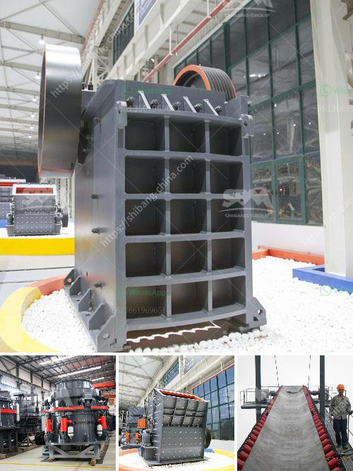

<h3>project cost of tpd ofcement plant in pakistan</h3>
Pakistan's cement industry plays a vital role in the economic development of the country. With a rapidly growing population, urbanization, and expansion in the construction sector, the demand for cement has significantly increased in recent years. This surge has prompted many companies to invest in the construction of new cement plants across the nation. This article will shed light on the project cost of a 1000 TPD (tons per day) cement plant in Pakistan.

1. Location: The chosen location for the plant significantly impacts the cost, mainly due to transportation and infrastructure expenses. It is advisable to select a site near raw material sources and major markets, reducing transportation costs and enhancing profitability.

2. Size and capacity: The scale of a cement plant determines various costs, such as land acquisition, construction expenses, and labor requirements. A 1000 TPD plant can be considered a medium-sized cement plant in Pakistan, capable of producing a considerable amount of cement daily.

3. Technology and machinery: The technological advancements and machinery used within the plant affect the project cost. Higher efficiency equipment can increase productivity and reduce operational costs in the long run. However, the initial investment might be higher.

4. Raw material availability: Availability and proximity of limestone, clay, gypsum, and other necessary raw materials affect both the project cost and the overall profitability. Choosing an area with ample supplies reduces transportation costs and ensures a continuous supply chain.

5. Regulatory and environmental clearances: Obtaining necessary permits and adhering to environmental regulations add to the overall project cost. Compliance with safety, emission, and waste management standards is crucial but may require additional investments.

While it is challenging to provide an exact figure for the project cost of a 1000 TPD cement plant due to various factors, we can outline a general range based on industry trends.

Typically, a cement plant of this capacity may require an investment between $50 million to $100 million, excluding land. The range accounts for variations in location, construction costs, machinery requirements, and other factors.

The major components of the project cost include land acquisition, construction, plant machinery, equipment, utilities (such as power, water), and the commissioning and testing phase.

With the increasing demand for cement in Pakistan, investing in a new cement plant can prove to be a lucrative opportunity. The project cost for a 1000 TPD cement plant can range between $50 million to $100 million, depending on various factors such as location, size, technology, and raw material availability.

Careful planning, feasibility studies, and consideration of input costs and potential outcomes are crucial for investors interested in establishing a cement plant in Pakistan. Moreover, adhering to regulatory and environmental norms is essential for sustainable business operations.

A well-executed project can not only contribute to the growth of Pakistan's cement sector but also generate employment opportunities, boost the local economy, and meet the rising demand for cement in the country.
<h3>Contact us</h3><ul><li><strong>Whatsapp:&nbsp;<a href="https://wa.me/8613661969651">+8613661969651</a></strong></li><li><a href="https://swt.shibang-china.com/?git&amp;zhl&amp;project cost of tpd ofcement plant in pakistan"><strong>Online Service(chat now)</strong></a></li></ul><h3>Related</h3><ul><li><a href='crusher in hialeah sale.md'>crusher in hialeah sale</a></li><li><a href='basalt crushing equipment.md'>basalt crushing equipment</a></li><li><a href='types of crushers ppt.md'>types of crushers ppt</a></li><li><a href='ultrafiner grinding mill.md'>ultrafiner grinding mill</a></li><li><a href='gold crusher equipment.md'>gold crusher equipment</a></li></ul>