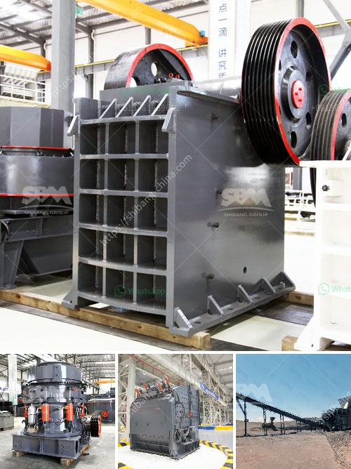

<h3>project of crushing and screening stone crusher machine</h3>
Crushing and screening stone crusher machine is vital for reducing the size of stones to ensure that they are fit for construction purposes. As technology continues to improve, the machine has proven to be essential in today's modern construction projects. The machine works by using pressure to reduce the size of stones, breaking them into smaller, more manageable pieces.

One of the primary advantages of the stone crusher machine is its versatility. It can be used for crushing and screening a wide range of materials, making it highly suitable for various applications. Whether you need to crush stones for road construction, building foundations, or landscaping projects, this machine can efficiently handle the job.

1. Primary crushing: In this stage, large rocks are fed into the machine and are crushed to smaller pieces. This initial crushing is usually done with the help of a jaw crusher, which reduces the rocks to a size that can be handled by the secondary crusher.

2. Secondary crushing: After the primary crushing stage, the smaller pieces of rocks are further crushed using a cone crusher or impact crusher. These secondary crushers have specialized chambers that help in the crushing process, ensuring maximum efficiency.

3. Screening: Once the stones are crushed to the desired size, they are screened to separate them based on their size and quality. This is important as it ensures that only the finest quality stones are used for construction purposes. The screening process can be done using screens or sieves that separate the stones based on their size.

The use of stone crusher machines has greatly revolutionized the construction industry, making it easier to manage and complete construction projects. The machine is capable of crushing and screening stones simultaneously, giving you a more efficient and effective operation.

In addition to its efficiency, the stone crusher machine also has a high degree of automation. With the help of modern technology, the machine can be programmed to operate automatically, reducing the need for manual intervention. This not only saves time but also reduces the risk of human error.

Another significant advantage of the stone crusher machine is its compact design. Unlike traditional crushers, which are often bulky and difficult to transport, this machine can be easily transported to different construction sites. This makes it suitable for both large-scale construction projects and smaller, more localized jobs.

To ensure the longevity of the machine and maintain its efficiency, regular maintenance and servicing are crucial. This includes cleaning, lubricating, and inspecting the machine to identify any potential issues before they escalate. Following the manufacturer's guidelines for maintenance will help extend the lifespan of the machine and ensure its optimal performance.

In conclusion, the project of crushing and screening stone crusher machine is an essential aspect of modern construction projects. The machine ensures that stones are crushed and screened to meet the required specification, ensuring a high-quality end result. With its versatility, efficiency, and automation features, the machine has become a vital tool in the construction industry, simplifying the process and improving overall productivity.
<h3>Contact us</h3><ul><li><strong>Whatsapp:&nbsp;<a href="https://wa.me/8613661969651">+8613661969651</a></strong></li><li><a href="https://swt.shibang-china.com/?git&amp;zhl&amp;project of crushing and screening stone crusher machine"><strong>Online Service(chat now)</strong></a></li></ul><h3>Related</h3><ul><li><a href='manual stone crusher in kenya.md'>manual stone crusher in kenya</a></li><li><a href='used gold mining equipment for sale in ghana.md'>used gold mining equipment for sale in ghana</a></li><li><a href='stone processing equipment turkey company.md'>stone processing equipment turkey company</a></li><li><a href='cement plant equipment.md'>cement plant equipment</a></li><li><a href='stone crushing machines uk.md'>stone crushing machines uk</a></li></ul>