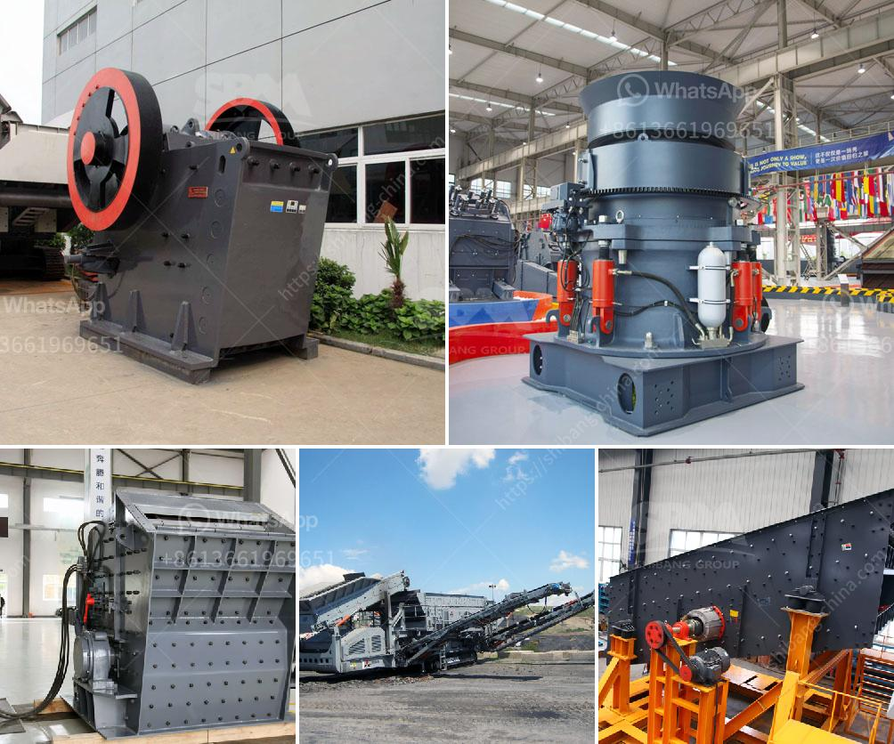

<h3>project proposal on stone crushing plant</h3>
Stone crushing plant, or stone crushing plant 300-500tph, is a system designed for large-scale stone quarrying activities. The plant is made up of several components that include vibrating feeder, PE jaw crusher, impact crusher, vibrating screen, and conveyor belts. It uses dedicated crushing equipment for crushing materials, allowing them to be recycled for future use. This project proposal aims to utilize thousands of tons of leftover materials from stone quarrying activities, which will benefit both the environment and the local economy.

The stone crushing plant is widely used in quarrying activities; it is especially suitable for crushing limestone and granite materials into smaller sizes due to its high productivity and ease of maintenance. The impact crusher is specially designed for crushing large rocks to a medium size with fewer fines produced, which is ideal for the production of fine aggregates. This equipment is able to control the particle size of the crushed materials, making it suitable for various applications like road construction, building construction, and concrete production.

The proposed stone crushing plant consists of a vibrating feeder, PE jaw crusher, PF impact crusher, vibrating screen, and belt conveyor. When crushed materials enter the PF impact crusher, they will be impacted by the blow bars and be thrown to the impact plates. After multiple impacts, the materials will be crushed to the required size and discharged from the bottom of the machine. The vibrating screen will classify the crushed materials into different sizes, and oversize materials will be recirculated back into the impact crusher for further crushing until the desired size is achieved. The final products will be conveyed by the belt conveyor for storage or transportation.

The stone crushing plant project proposal is suitable for any organization with the desire to improve the crushing efficiency and reduce the high costs of investment during the operation of the crushing plant. The project aims to improve the environmental conditions in the surrounding area through the proper management of waste generated during the crushing process. By implementing this stone crushing plant, the local community will benefit from the reduced environmental impact, improved air quality, and a new source of employment opportunities.

Furthermore, the project proposal could potentially expand the stone quarrying activities in the area, as it provides an effective solution for the utilization of leftover materials. This will increase the longevity and profitability of the quarrying operations and ensure sustainable development. Additionally, the increased production capacity of the stone crushing plant will fulfill the growing demand for construction materials in the local market.

In conclusion, the project proposal for the stone crushing plant is a win-win solution, as it not only fulfills the environmental obligations but also benefits the local community by creating job opportunities and providing construction materials. With the successful implementation of this project, the stone crushing plant will become a model for future mining and quarrying activities, reducing waste and improving the efficiency of the entire process.
<h3>Contact us</h3><ul><li><strong>Whatsapp:&nbsp;<a href="https://wa.me/8613661969651">+8613661969651</a></strong></li><li><a href="https://swt.shibang-china.com/?git&amp;zhl&amp;project proposal on stone crushing plant"><strong>Online Service(chat now)</strong></a></li></ul><h3>Related</h3><ul><li><a href='stone quarry crusher in ghana.md'>stone quarry crusher in ghana</a></li><li><a href='crusher machines suppliers in south africa.md'>crusher machines suppliers in south africa</a></li><li><a href='cost of gold bow mill for sale in south africa.md'>cost of gold bow mill for sale in south africa</a></li><li><a href='to produce tons of li ne powder.md'>to produce tons of li ne powder</a></li><li><a href='gemstones found in nigeria.md'>gemstones found in nigeria</a></li></ul>