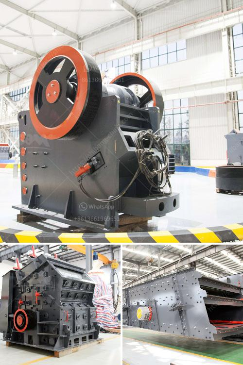

<h3>project report for establishing stone crusher</h3>
Stone crushing industry is an important industrial sector in the country. This is due to the fact that it uses raw materials for various construction activities like building roads, highways, bridges, buildings, and canals. As a result, there is a high demand for stone crushers in the market.

In recent years, with the growth of the construction industry, the need for stone crushers has increased significantly. To meet the growing demand, it is necessary to establish a stone crusher to crush the stones into different sizes for further usage.

Project report for a stone crusher project: The project consists of the operation of a stone crusher plant, crushing of stones. The crushing plant will be powered by electrical energy through a generator set. The power required for the project will be sourced from the grid, which will be sufficient to meet the electricity demand during peak hours.

The total project cost is estimated at around Rs. 20 million, with a total capital cost of Rs. 11.6 million and a working capital of Rs. 8.4 million. The project is expected to generate a total annual revenue of approximately Rs. 14.5 million.

The project location is strategically located near major construction projects. This will ensure a steady supply of raw materials and a ready market for the crushed stones. The raw materials required for the project include stone boulders of various sizes.

The production capacity of the stone crusher plant is estimated to be 2,400 tons per year. The plant will operate 24 hours a day. The material crushed by the stone crusher will be transferred to a vibrating screen. The screen will separate the crushed stone into different sizes depending on the final product requirements.

To start the stone crusher project, the entrepreneur should apply for the necessary approvals and clearances from the relevant government departments. This includes obtaining land clearance, mining lease, and environmental clearance.

The stone crusher project will also involve the installation of water sprinklers at strategic locations near the crusher to control the dust emission during the crushing process. This will help to reduce the environmental impact and maintain a clean and healthy environment.

The project will generate direct employment opportunities for skilled and unskilled workers. It will also stimulate the local economy by generating business opportunities for the suppliers of raw materials, fuel, and other services required for the operation of the stone crusher plant.

In conclusion, establishing a stone crusher plant is a profitable venture for new entrepreneurs. The demand for crushed stones is increasing continuously, and the market is expected to grow even further in the coming years. Therefore, investing in a stone crusher project is a good option for any individual or company looking to generate steady income and contribute to the development of the construction industry.
<h3>Contact us</h3><ul><li><strong>Whatsapp:&nbsp;<a href="https://wa.me/8613661969651">+8613661969651</a></strong></li><li><a href="https://swt.shibang-china.com/?git&amp;zhl&amp;project report for establishing stone crusher"><strong>Online Service(chat now)</strong></a></li></ul><h3>Related</h3><ul><li><a href='used portable rock crusher for sale.md'>used portable rock crusher for sale</a></li><li><a href='jaw crusher price south africa.md'>jaw crusher price south africa</a></li><li><a href='how to set up a quarry plant.md'>how to set up a quarry plant</a></li><li><a href='crusher company in kenya.md'>crusher company in kenya</a></li><li><a href='crusher suppliers usa.md'>crusher suppliers usa</a></li></ul>