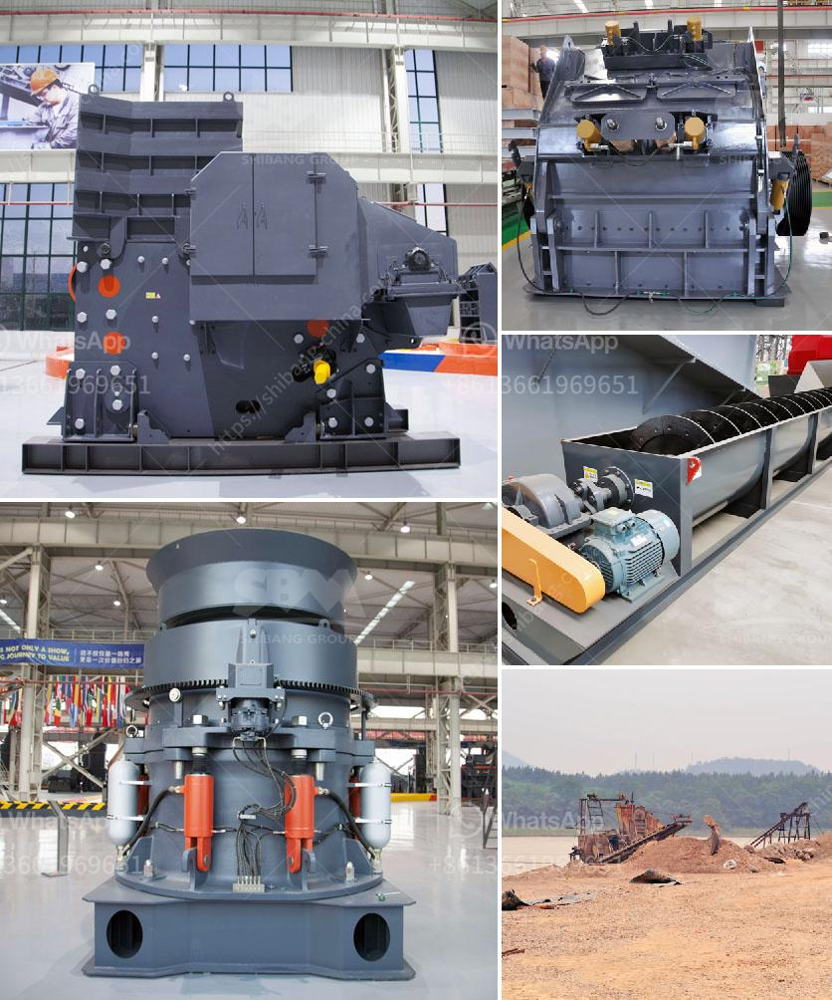

<h3>project report granite cutting file</h3>
Granite is a versatile and durable material that has been widely used in construction projects for centuries. Its beauty and strength make it a popular choice for countertops, flooring, and other applications. However, working with granite can be challenging without the right tools and equipment.

One essential tool for cutting granite is a granite cutting file. This file is specifically designed to shape and smooth granite surfaces, making it easier to create precise cuts and achieve the desired finish. The granite cutting file is an indispensable tool for contractors, fabricators, and DIY enthusiasts working with this natural stone.

A project report on granite cutting file aims to analyze the manufacturing process, the market demand, and the potential profitability of producing this tool. The report provides valuable insights for entrepreneurs and investors looking to start a granite cutting file manufacturing business.

The manufacturing process of a granite cutting file involves several steps. Firstly, the raw material, typically high-quality hardened steel, is selected. The steel is carefully annealed to reduce its hardness, making it easier to shape. The annealed steel is then cut into the desired length and width, forming the base of the file.

Next, the teeth of the cutting file are formed. A series of V-shaped grooves are carefully cut into the surface of the file using precision tools and machinery. These grooves are crucial in the cutting process, as they effectively remove material when the file is used on granite.

After the teeth are cut, the file is hardened to increase its durability and strength. This process involves heating the file to a specific temperature and then rapidly cooling it. Hardening the file ensures that it can withstand the high-pressure and friction involved in cutting granite.

Once the file is hardened, it undergoes a series of quality checks to ensure that it meets the required specifications. This includes checking the teeth alignment, the hardness, and the overall durability of the file. Only files that pass these quality checks are deemed fit for the market.

The market demand for granite cutting files is driven by the construction industry's growth and the increasing popularity of granite as a building material. Granite is widely used in residential and commercial projects, making the demand for cutting files high. Additionally, the DIY market has seen significant growth, with more homeowners taking on home improvement projects themselves, further driving the demand for cutting tools.

A project report on granite cutting file must also analyze the potential profitability of manufacturing this tool. Factors such as the cost of raw materials, equipment, labor, and market prices need to be considered. The report should also evaluate the competition and identify marketing strategies to penetrate the market effectively.

In conclusion, a project report on granite cutting file is essential for entrepreneurs and investors interested in starting a granite cutting file manufacturing business. This report provides valuable insights into the manufacturing process, market demand, and potential profitability of producing this tool. With the right analysis and planning, a granite cutting file manufacturing business can be a lucrative venture in the construction industry.
<h3>Contact us</h3><ul><li><strong>Whatsapp:&nbsp;<a href="https://wa.me/8613661969651">+8613661969651</a></strong></li><li><a href="https://swt.shibang-china.com/?git&amp;zhl&amp;project report granite cutting file"><strong>Online Service(chat now)</strong></a></li></ul><h3>Related</h3><ul><li><a href='italy stone crusher manufacter.md'>italy stone crusher manufacter</a></li><li><a href='limestone mill suppliers in china.md'>limestone mill suppliers in china</a></li><li><a href='3 4 inch crushed limestone.md'>3 4 inch crushed limestone</a></li><li><a href='cone crusher manufacturer.md'>cone crusher manufacturer</a></li><li><a href='best crusher for quartz powder.md'>best crusher for quartz powder</a></li></ul>