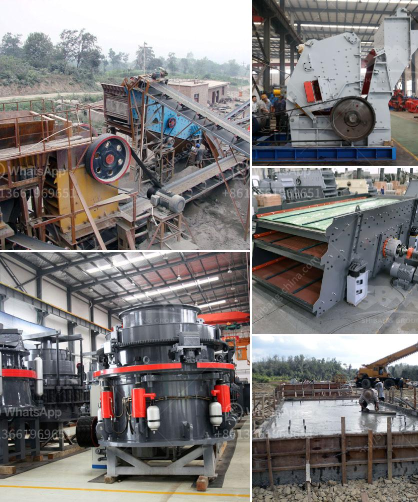

<h3>proposal on quarry business</h3>
Running a quarry business can be a lucrative venture that provides essential materials to various industries. From construction to landscaping, quarries play a critical role in meeting industry demands. If you're considering starting a quarry business, this proposal will outline the necessary steps to ensure a successful venture.

Before diving into the quarry industry, it is crucial to conduct thorough market research. Assess the demand and competition in your target market. Understand the type and quantity of materials required by potential customers. Identifying niche markets or unique selling propositions can give your business a competitive edge.

Choosing the right location for your quarry is paramount. Researching areas with abundant resources while considering proximity to transportation routes, such as highways or rail lines, is crucial. Additionally, ensure that the site meets environmental regulations to avoid legal hurdles in the future.

Obtaining the necessary permits and adhering to local and federal regulations is vital before commencing operations. Consult with environmental agencies, local authorities, and legal experts to ensure compliance. Failure to comply with regulations could result in hefty fines, delays, or even closure of your business.

Develop a comprehensive business plan that outlines your goals, strategies, and financial projections. Include details about the types of materials your quarry will supply, target customers, marketing strategies, and operational plans. A well-crafted business plan can help attract investors or secure funding from financial institutions.

Investing in high-quality equipment is essential for efficient quarry operations. Purchase or lease reliable machinery, such as loaders, crushers, and conveyors, based on the scope of your business. Hiring skilled staff, including operators, engineers, maintenance personnel, and sales representatives, is crucial for smooth operations.

Promote safety as a top priority. Establish safety policies and protocols to ensure the well-being of workers and visitors. Provide all necessary safety equipment and conduct regular training sessions to educate employees about potential risks and their prevention. Compliance with safety regulations not only safeguards lives but also enhances the reputation of your quarry.

Develop a robust marketing and sales strategy to promote your quarry business. Network with construction companies, architects, landscaping firms, and other potential customers. Attend industry trade shows, seminars, and exhibitions to showcase your products and services.

Maintain stringent quality control processes to ensure that the materials supplied by your quarry meet industry standards. Regularly test products for strength, size, and purity to build trust with customers. Providing consistent, high-quality materials can lead to word-of-mouth recommendations and repeat business.

Incorporate sustainable practices into your quarry operations. Focus on environmental conservation by actively participating in land rehabilitation programs. Adopt measures to minimize dust and noise pollution. Demonstrating a commitment to sustainability can attract environmentally conscious customers and earn community support.

Effective financial management is crucial for sustaining and expanding your quarry business. Implement sound accounting practices, monitor expenses, and maintain healthy cash flow. Regularly review your business's financial performance and make necessary adjustments to ensure profitability.

In conclusion, starting a quarry business requires careful planning, market research, and compliance with regulations. With the right strategies and a focus on quality and sustainability, a quarry business can thrive in meeting the demands of various industries while creating a profitable venture.
<h3>Contact us</h3><ul><li><strong>Whatsapp:&nbsp;<a href="https://wa.me/8613661969651">+8613661969651</a></strong></li><li><a href="https://swt.shibang-china.com/?git&amp;zhl&amp;proposal on quarry business"><strong>Online Service(chat now)</strong></a></li></ul><h3>Related</h3><ul><li><a href='cost of cement clinker grinding unit.md'>cost of cement clinker grinding unit</a></li><li><a href='gold crusher equipment.md'>gold crusher equipment</a></li><li><a href='iron crushing plant for sale.md'>iron crushing plant for sale</a></li><li><a href='costs of a cone crusher.md'>costs of a cone crusher</a></li><li><a href='copper mining equipment suppliers south america.md'>copper mining equipment suppliers south america</a></li></ul>