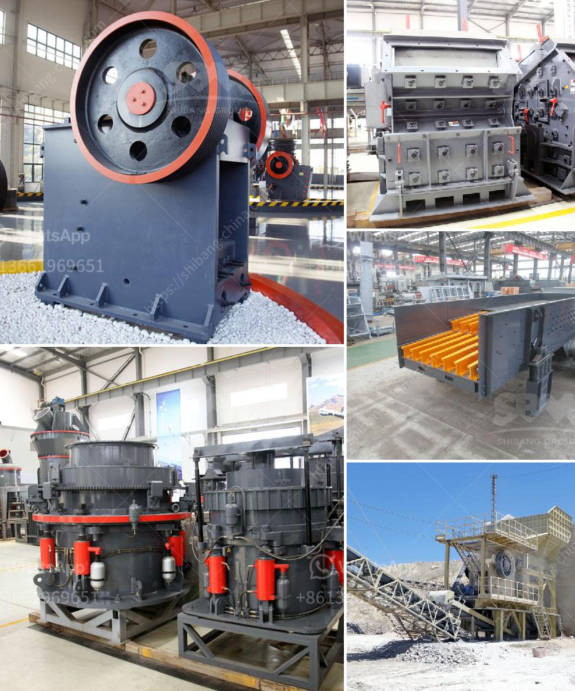

<h3>provider of conveyor belts for mining</h3>
Mining operations require reliable and efficient equipment to move materials from one place to another. Conveyor belts play a crucial role in this process by transporting bulk materials over long distances, reducing the time and effort required to move heavy loads. Therefore, it is essential to choose a reliable provider of conveyor belts for mining that can meet the demanding requirements of the industry.

One such provider that stands out in the market is XYZ Conveyor Belts. With a strong reputation and years of experience in the mining industry, XYZ Conveyor Belts is a trusted name for delivering top-quality conveyor belts that enable efficient material handling in mining operations.

One of the key factors that sets XYZ Conveyor Belts apart from its competitors is their commitment to product quality. The company utilizes the latest manufacturing technologies and adheres to strict quality control measures to ensure that their conveyor belts are of the highest standards. By using premium-grade materials, the belts offered by XYZ Conveyor Belts are durable, resistant to wear and tear, and can withstand the harsh working conditions found in mining operations.

In addition to their focus on quality, XYZ Conveyor Belts understands the unique needs and challenges faced by the mining industry. As a result, they offer a wide range of conveyor belts that are specifically designed to cater to the demands of the mining sector. These belts are capable of handling heavy loads, are flame-resistant, and can operate in extreme temperatures. Furthermore, XYZ Conveyor Belts provides customizable options to meet the specific requirements of different mining operations, ensuring that their customers receive conveyor belts tailored to their needs.

Reliability and efficiency are critical factors in mining operations, and XYZ Conveyor Belts excels in both areas. Their belts are manufactured with advanced engineering techniques, resulting in minimal downtime and maximum productivity. With their high tensile strength and smooth operation, XYZ Conveyor Belts' products have a longer lifespan, reducing the need for frequent replacements and maintenance. This not only saves time and costs but also facilitates a seamless workflow, enabling mining operations to run smoothly and efficiently.

Moreover, XYZ Conveyor Belts takes pride in their exceptional customer service. Their team of experts is knowledgeable and responsive, assisting customers in selecting the most suitable conveyor belts for their mining operations. XYZ Conveyor Belts also offers comprehensive after-sales support, including maintenance services and prompt assistance in case of any emergencies. This ensures that their customers can rely on their products and have peace of mind knowing that they are supported every step of the way.

In conclusion, XYZ Conveyor Belts is a reputable provider of conveyor belts for the mining industry. Their commitment to quality, understanding of mining requirements, and focus on reliability and efficiency make them an excellent choice for any mining operation. By choosing XYZ Conveyor Belts, mining companies can enhance their material handling processes, improve productivity, and experience a seamless workflow, ultimately leading to increased profitability.
<h3>Contact us</h3><ul><li><strong>Whatsapp:&nbsp;<a href="https://wa.me/8613661969651">+8613661969651</a></strong></li><li><a href="https://swt.shibang-china.com/?git&amp;zhl&amp;provider of conveyor belts for mining"><strong>Online Service(chat now)</strong></a></li></ul><h3>Related</h3><ul><li><a href='sample contract mining agreement.md'>sample contract mining agreement</a></li><li><a href='copper slag crusher machine manufacturer india.md'>copper slag crusher machine manufacturer india</a></li><li><a href='quartz stone powder manufacturing plant in india.md'>quartz stone powder manufacturing plant in india</a></li><li><a href='crushers of germany.md'>crushers of germany</a></li><li><a href='china clay grinding machine.md'>china clay grinding machine</a></li></ul>