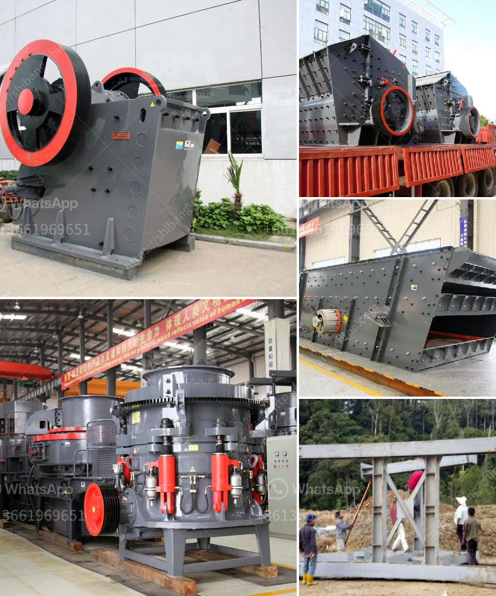

<h3>providers conveyor belts in mexico</h3>
Conveyor belts are mechanized systems that play a crucial role in numerous industries, including manufacturing, mining, food processing, airports, and logistics. These systems efficiently move materials, products, and goods along a predetermined path, significantly enhancing production processes and streamlining logistics operations. In Mexico, the conveyor belt industry is robust, meeting the growing demand for efficient material handling and automation.

Providers of conveyor belts in Mexico offer a wide range of products and services to cater to various industries' needs. They offer standard belts as well as specialized belts designed for specific applications, such as high-temperature environments, extreme cold conditions, or corrosive materials. These belts are built to withstand heavy loads and prolonged usage, ensuring maximum durability and reliability.

One of the significant industries benefiting from conveyor belt providers in Mexico is manufacturing. Conveyor belts greatly enhance production lines by automating the movement of raw materials, components, and finished products. This automation eliminates the need for manual handling, reducing labor costs while increasing productivity and safety. With the help of conveyor belts, manufacturers can achieve faster turnaround times and maintain consistent product quality.

The mining industry in Mexico also heavily relies on conveyor belts for efficient material transportation. Conveyor systems can handle large volumes of minerals, coal, ores, and other materials, reducing the need for manual labor and traditional transportation methods. Moreover, conveyor belts enable continuous material flow, reducing downtime and improving production efficiency. In this industry, conveyor belt providers in Mexico must meet stringent safety and durability requirements to withstand harsh environmental conditions and heavy loads.

Food processing is another sector that benefits greatly from conveyor belt providers in Mexico. Food-grade conveyor belts are specifically designed to meet stringent hygiene standards and ensure food safety. These belts are resistant to oil, grease, moisture, and other contaminants. Conveyor systems in the food industry are used for various processes, such as washing, sorting, packaging, and transportation. The use of conveyor belts improves productivity, reduces manual labor and handling, and minimizes the risk of contamination during food processing.

Logistics and warehousing companies in Mexico also heavily rely on conveyor belt systems to streamline operations. These belts enable the efficient movement of goods, packages, and parcels, reducing manual labor and speeding up order fulfillment processes. Conveyor belts can be integrated into automated warehouses, sorting centers, and distribution facilities, allowing for efficient movement, tracking, and sorting of items. This automation improves overall logistics efficiency and reduces operational costs.

In conclusion, providers of conveyor belts in Mexico play a critical role in promoting efficient production and logistics across various industries. Their diverse product range and expertise cater to the specific needs of different sectors, ensuring maximum productivity, durability, and safety. With the help of conveyor belts, businesses in Mexico can enhance their operations, improve overall efficiency, and stay competitive in today's rapidly evolving industrial landscape.
<h3>Contact us</h3><ul><li><strong>Whatsapp:&nbsp;<a href="https://wa.me/8613661969651">+8613661969651</a></strong></li><li><a href="https://swt.shibang-china.com/?git&amp;zhl&amp;providers conveyor belts in mexico"><strong>Online Service(chat now)</strong></a></li></ul><h3>Related</h3><ul><li><a href='hammer mill prices south africa.md'>hammer mill prices south africa</a></li><li><a href='high speed limestone milling machine.md'>high speed limestone milling machine</a></li><li><a href='rock cone crusher.md'>rock cone crusher</a></li><li><a href='business plan for sand making machine.md'>business plan for sand making machine</a></li><li><a href='high purity quartz crusher processing.md'>high purity quartz crusher processing</a></li></ul>