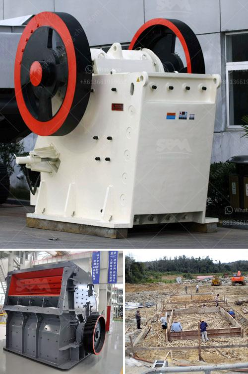

<h3>pulverizer crusher machine for limestone</h3>
Limestone ore is a sedimentary rock composed largely of the minerals calcite and aragonite, which are different crystal forms of calcium carbonate (CaCO3). Crushed limestone is used as roadstone, construction fill, iron smelting, ceramic wall tiles, and flue gas desulphurization.

Limestone pulverizer machine, the limestone pulverizer machine is a equipment which can crush many limestone materials into fine powder. The output size of the limestone pulverizer machine can be adjusted between 30 and 325 mesh. The limestone pulverizer machine has a strong pulverizing capability, high crushing ratio, and easy operation.

Limestone pulverizer machine is used to grind limestones or rocks and mine ores into powder in ore mining process, construction setting up supplies, cement grinding plant and ceramics sector. Also, pulverizer machine can be used to grind coal, marble, granite, kaolin, hard coke etc. So many various options, there are always a ideal crushing equipment for the materials that you want to grind.

The limestone pulverizer machine is utilized to grind different varieties of materials, such as limestone, barite, ceramics, quartz, rock phosphate, marble, talcum, gypsum, pebbles, mica, calcite, dolomite, bauxite, cinnabar, granite, porphyry, and many others. The limestone pulverizer machine is available with an alpha flow and a roller mill, and they are ideal for processing non-explosive, non-inflammable, hard and brittle ores.

The limestone crusher machine that we manufactured is designed based on new technology research and development. It has been widely used in cement industry, chemical industry, power industry, etc. Crushing limestone possesses high crushing ratio, stable operation, convenient maintenance and low operation cost. Furthermore, limestone crushing can be processed in three stages: primary crushing, secondary crushing, and tertiary crushing.

The pulverizer machine is a popular limestone processing equipment in the market. Here are some benefits of limestone pulverizer machine:

Under the same finished final size and the same motor power, the capacity of the machine is twice as much as jet mill, mixing grinder and ball mill, and energy consumption decreased 30%.

The ring and roller are forged by special material with high utilization. Under the same grinding material and finish special size, the lifecycle of spare parts is about one year, which is 2-3 times longer than impact mill or turbo mill.

As no rolling bearings or screws in grinding cavity, there are no problems caused by bolts shedding or rapid wear of bearings and seal components.

In conclusion, pulverizer machines are used to crush materials into different sizes for various applications. The limestone pulverizer machine is commonly used in highway construction, demolition, and construction waste recycling, all of which require high processing performance. Along with the increasing demand for pulverized limestone, the market demand for limestone pulverizer machines is also increasing. Therefore, it is important to choose a reliable manufacturer and supplier of limestone pulverizer machines to ensure the machine's performance and quality meet your requirements.
<h3>Contact us</h3><ul><li><strong>Whatsapp:&nbsp;<a href="https://wa.me/8613661969651">+8613661969651</a></strong></li><li><a href="https://swt.shibang-china.com/?git&amp;zhl&amp;pulverizer crusher machine for limestone"><strong>Online Service(chat now)</strong></a></li></ul><h3>Related</h3><ul><li><a href='the process of preparation coal.md'>the process of preparation coal</a></li><li><a href='mobile crushers gravels.md'>mobile crushers gravels</a></li><li><a href='grinding feldspar for glazes.md'>grinding feldspar for glazes</a></li><li><a href='manufacturers of conveyor belts in mexico.md'>manufacturers of conveyor belts in mexico</a></li><li><a href='mobile screening plant for sale.md'>mobile screening plant for sale</a></li></ul>