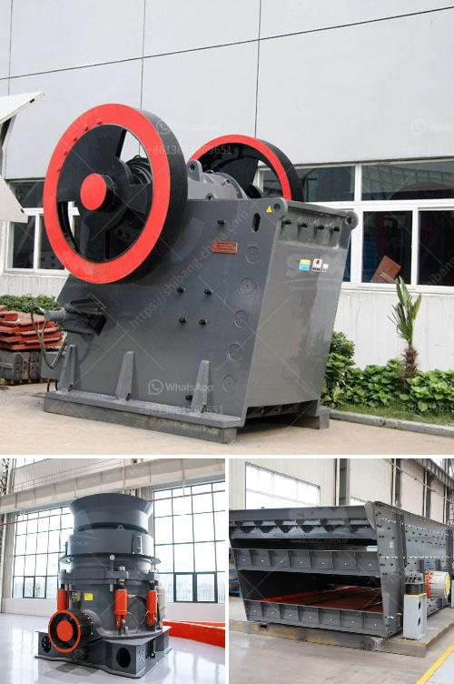

<h3>pulverizer crusher manufacturers ppt</h3>
The demand for crushing equipment is on the rise these days due to the rapid growth in the construction and mining industries. Crushers are widely used in these sectors to reduce large rocks into smaller, more manageable sizes. However, the success of any crushing operation depends on the quality and efficiency of the equipment used. This is where pulverizer crusher manufacturers step in, offering state-of-the-art crushing machines designed to meet diverse needs.

Pulverizer crusher manufacturers specialize in producing crushers that are efficient and reliable. These machines are equipped with advanced technologies and features that enhance their performance and deliver consistent results. Whether it is a primary jaw crusher or a secondary impact crusher, every model offered by these manufacturers is designed to cater to specific requirements.

One key feature of pulverizer crusher manufacturers' machines is their user-friendly operation. These crushers come with intuitive control panels that allow operators to adjust various parameters easily. With clear instructions and straightforward mechanisms, even inexperienced users can operate these machines efficiently, saving time and effort.

Another significant advantage of choosing pulverizer crusher manufacturers is their focus on research and development. These companies invest heavily in innovation to stay ahead of their competition. They continuously strive to develop new technologies that increase crushing efficiency, reduce downtime, and enhance overall productivity. By keeping up with the latest trends and adopting cutting-edge advancements, pulverizer crusher manufacturers offer state-of-the-art machines that exceed customer expectations.

Besides their focus on innovation, pulverizer crusher manufacturers also prioritize the quality of their machines. They use high-quality materials and modern manufacturing techniques to ensure the durability and robustness of their crushers. By sourcing components from trusted suppliers and rigorously testing their products, these manufacturers guarantee that their machines can withstand even the harshest working conditions.

Moreover, pulverizer crusher manufacturers also provide comprehensive after-sales support. They understand that investing in a crusher is a significant decision for their customers, and they want to ensure their satisfaction in the long run. These manufacturers offer maintenance services, spare parts, and technical assistance to keep their machines running smoothly. With prompt customer support, they address any queries or issues customers might face, ensuring minimal downtime and maximum efficiency.

In conclusion, the importance of choosing the right crusher cannot be overstated in the construction and mining industries. Pulverizer crusher manufacturers have proven expertise in manufacturing efficient and reliable crushers to meet the increasing demand. Their focus on innovation, quality, user-friendly operation, and comprehensive after-sales support set them apart from their competitors. By investing in these cutting-edge machines, businesses can benefit from increased productivity, reduced downtime, and overall cost-effectiveness. So, when it comes to crushing solutions, it is wise to go with pulverizer crusher manufacturers who deliver excellence.
<h3>Contact us</h3><ul><li><strong>Whatsapp:&nbsp;<a href="https://wa.me/8613661969651">+8613661969651</a></strong></li><li><a href="https://swt.shibang-china.com/?git&amp;zhl&amp;pulverizer crusher manufacturers ppt"><strong>Online Service(chat now)</strong></a></li></ul><h3>Related</h3><ul><li><a href='iron crushing equipment.md'>iron crushing equipment</a></li><li><a href='second hand crusher machine price.md'>second hand crusher machine price</a></li><li><a href='clay grinding machine for sale china.md'>clay grinding machine for sale china</a></li><li><a href='gypsum board processing machinery.md'>gypsum board processing machinery</a></li><li><a href='quarry machine in nigeria.md'>quarry machine in nigeria</a></li></ul>