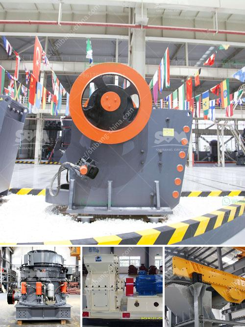

<h3>pulverizer grinding machine philippines</h3>
The Philippines is known for its rich and diverse natural resources. With its extensive reserves of minerals, it is a potential goldmine for industries involved in mining, construction, and manufacturing. One essential machine that is instrumental in maximizing these resources is the pulverizer grinding machine.

A pulverizer grinding machine is a mechanical device utilized for pulverizing, grinding, and crushing different types of materials, such as grains, minerals, coal, and many others. It is primarily used for grinding materials and offers various advantages over traditional machines, including greater efficiency, accuracy, and uniformity.

In the Philippines, a pulverizer grinding machine is generally used for grinding rice, sugar, corn, coffee, and various other agricultural and food products. Eager to know more about this versatile machine? Let's dive into the details!

Firstly, a pulverizer grinding machine is composed of different parts, such as a feeding hopper, a feed screw, a rotating disc, and a discharge hopper. It is capable of grinding materials to a fine powder, which is ideal for numerous applications, including ingredient preparation for cooking, food processing, feed manufacturing, and other industrial uses.

When it comes to grinding rice in the Philippines, a pulverizer grinding machine is an excellent option. Rice, the staple food of Filipinos, needs to be finely ground to produce high-quality rice flour. This flour is a key ingredient in numerous Filipino dishes and is also used in the production of rice noodles, cakes, and other rice-based products.

Beyond rice, a pulverizer grinding machine is also used in corn grinding. Corn is another widely consumed staple food in the Philippines, and grinding it into fine cornmeal or flour is essential in various recipes and food processing industries. This versatile machine helps to break down the tough outer layer of corn kernels, resulting in a finer texture and increased usability.

In addition to agriculture, a pulverizer grinding machine finds applications in the mining industry. The Philippines is rich in mineral resources, and grinding machines help in the extraction and processing of minerals, such as gold, copper, silver, and nickel. These machines are critical for reducing the size of the mined materials, ensuring uniformity for further processing.

Furthermore, the pulverizer grinding machine plays a crucial role in the construction industry. It is used for grinding and crushing construction materials, such as concrete, stones, and rocks, into smaller sizes. This process enables the production of fine aggregates and ensures the uniformity of materials for construction projects or as raw materials for manufacturing other construction products.

To summarize, a pulverizer grinding machine is a versatile and essential equipment in the Philippines for various industries. Whether grinding rice for staple food, processing corn for different recipes, extracting valuable minerals, or crushing construction materials, this machine is invaluable.

Moreover, the advent of advanced technologies has resulted in more efficient, accurate, and user-friendly pulverizer grinding machines. Therefore, industries in the Philippines can ensure higher productivity, reduced waste, and improved product quality.

As the country continues to harness its natural resources, the demand for pulverizer grinding machines in the Philippines is expected to increase. With their ability to efficiently grind and pulverize different materials, these machines will undoubtedly contribute to the growth and development of various industries, thereby propelling the country's economy forward.
<h3>Contact us</h3><ul><li><strong>Whatsapp:&nbsp;<a href="https://wa.me/8613661969651">+8613661969651</a></strong></li><li><a href="https://swt.shibang-china.com/?git&amp;zhl&amp;pulverizer grinding machine philippines"><strong>Online Service(chat now)</strong></a></li></ul><h3>Related</h3><ul><li><a href='german crusher plants.md'>german crusher plants</a></li><li><a href='vertical vertical grinding machine.md'>vertical vertical grinding machine</a></li><li><a href='price on a mining ball mill 10 tons per hour.md'>price on a mining ball mill 10 tons per hour</a></li><li><a href='philippines rock and granite quarries.md'>philippines rock and granite quarries</a></li><li><a href='best marble grinder mill.md'>best marble grinder mill</a></li></ul>