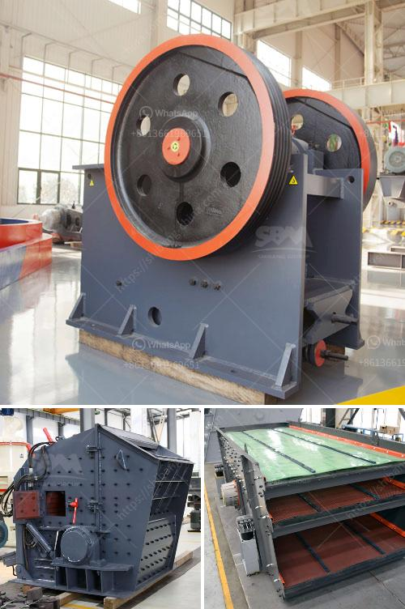

<h3>pulverizer limestone crusher manufacturer in india</h3>
A pulverizer limestone crusher manufacturer in India is one of the most commonly used construction waste crushing equipment. It is mainly used for crushing medium-hardness materials, such as limestone, coal, and zinc.

In recent years, with the rapid development of the Indian economy, the demand for pulverizer limestone crushers has grown significantly. The Indian market is filled with numerous limestone crusher manufacturers, each of them claiming to be the best in the industry. However, one name that stands out is that of Amarshiva Engineering Company.

Amarshiva Engineering Company is a well-known manufacturer and supplier of limestone crushers in India. They are a trusted name in the industry and have been providing top-quality equipment to their customers for many years. Their limestone crushers are known for their high performance, reliability, and durability.

One of the key features of Amarshiva Engineering Company's limestone crushers is their unique design. These crushers are designed in a way that ensures maximum crushing efficiency while minimizing energy consumption. The advanced technology used in their manufacturing process allows for easy maintenance and repair, ensuring that the equipment lasts for a long time.

Amarshiva Engineering Company offers a wide range of limestone crushers, including jaw crushers, impact crushers, and cone crushers. Each type of crusher is designed to meet specific crushing requirements and provide the best possible results. Their crushers can handle various sizes of limestone and can produce different output sizes, depending on the specific needs of the customers.

The company also provides excellent after-sales service and technical support to its customers. Their team of experts is always available to assist customers with any queries or issues they may have regarding their limestone crushers. They offer prompt and reliable service, ensuring that customers get the most out of their equipment.

As a responsible manufacturer, Amarshiva Engineering Company has also taken steps to reduce the environmental impact of their operations. They use energy-efficient equipment and have implemented various measures to minimize waste generation and promote sustainability. By choosing their limestone crushers, customers can contribute to environmental conservation while enjoying high-quality crushing equipment.

In conclusion, Amarshiva Engineering Company is a leading manufacturer and supplier of pulverizer limestone crushers in India. With their advanced technology, superior quality, and excellent after-sales service, they have earned the trust and respect of customers across the country. Whether it is for construction projects or industrial applications, their limestone crushers are a reliable choice. With Amarshiva Engineering Company, customers can expect efficient and durable equipment that meets their specific crushing needs.
<h3>Contact us</h3><ul><li><strong>Whatsapp:&nbsp;<a href="https://wa.me/8613661969651">+8613661969651</a></strong></li><li><a href="https://swt.shibang-china.com/?git&amp;zhl&amp;pulverizer limestone crusher manufacturer in india"><strong>Online Service(chat now)</strong></a></li></ul><h3>Related</h3><ul><li><a href='indonesia ball mill manufacturer.md'>indonesia ball mill manufacturer</a></li><li><a href='coal crushing machine.md'>coal crushing machine</a></li><li><a href='mobile crusher rent uae.md'>mobile crusher rent uae</a></li><li><a href='china crusher exporters mails hotmail com.md'>china crusher exporters mails hotmail com</a></li><li><a href='conveyor belts in opracion.md'>conveyor belts in opracion</a></li></ul>