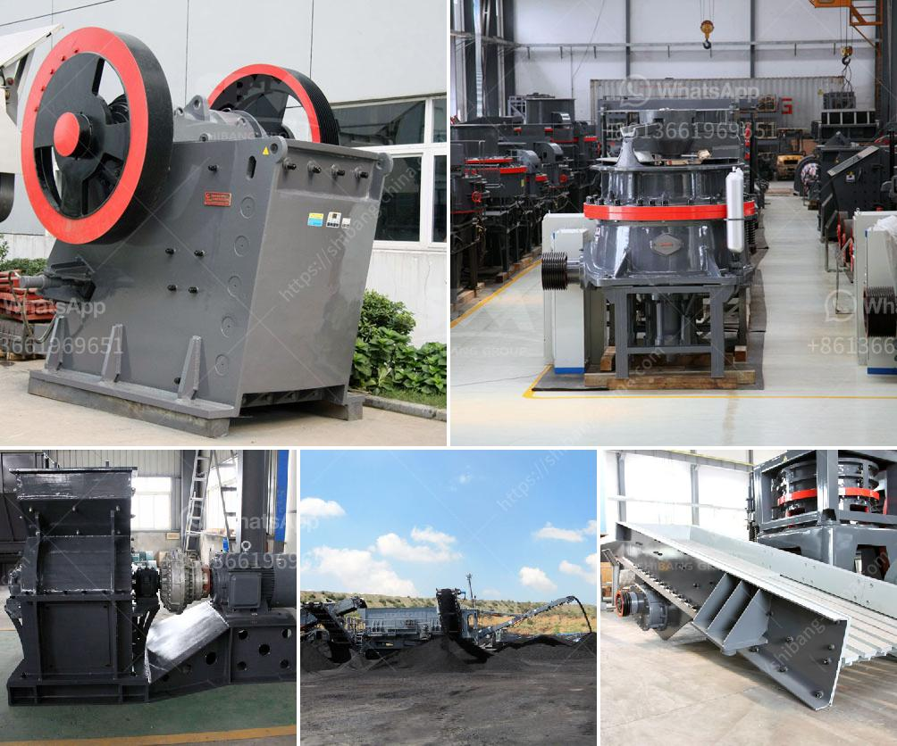

<h3>puzzolana 200 tph cone crushers parts</h3>
Puzzolana is a reputable brand in the construction industry and has been providing high-quality machines for various industrial applications. In recent years, Puzzolana has expanded its product range to cater to a wider range of customers, offering efficient and technologically advanced cone crushers.

The cone crusher plays an important role in the crushing industry, as the same cone crusher wear parts play an important role in cone crushers. Cone crusher wear parts include cone crusher mantle, cone crusher concave, cone crusher spider cap, top shell, and spider bushing. In addition, the cone crusher wear parts supplier can also design and manufacture the new cone crusher wear parts according to the drawings provided by customers. Moreover, the customers can enjoy better service during the whole cone crusher wear parts custom process.

Puzzolana 200 tph cone crushers parts are designed with utmost perfection and precision, keeping in mind the industrial requirements and parameters. These puzzolana cone crusher parts are robust and durable, providing higher dependability to the machine. They have been specially designed to suit the marshy and abrasive conditions of the construction industry. Puzzolana 200 tph cone crushers parts are made using premium quality materials to ensure longevity and performance.

The puzzolana 200 tph cone crushers parts come with advanced technological features to ensure better efficiency and performance. They are equipped with state-of-the-art automation technology and hydraulic systems to provide easy operation and maintenance. The cone crushers also come with an integrated overload protection system to ensure maximum durability and reliability in extreme operating conditions.

The parts of puzzolana 200 tph cone crushers are easy to maintain. The cone crusher wear parts supplier offers a wide range of compatible spare parts for servicing different machine models. These parts are made using high-quality materials to ensure the durability and reliability of the machine. The cone crusher wear parts supplier also provides timely and efficient customer service to resolve any issues or concerns faced by the customers.

Puzzolana 200 tph cone crushers parts are suitable for various industrial applications. They have been widely used in sectors like mining, construction, road building, metallurgy, and so on. The cone crusher wear parts are designed to withstand heavy-duty operations and provide higher productivity. With the help of the advanced features and robust construction, the puzzolana 200 tph cone crushers parts have gained popularity among the customers.

In conclusion, puzzolana 200 tph cone crushers parts are a reliable choice for any industrial application requiring high productivity and efficiency. With their advanced technology and durable construction, these cone crushers provide superior performance and longevity. The cone crusher wear parts supplier ensures that the customers are provided with top-quality parts that are compatible with their machines. Whether it is for mining, construction, or any other industry, puzzolana 200 tph cone crushers parts are a trusted solution for all crushing needs.
<h3>Contact us</h3><ul><li><strong>Whatsapp:&nbsp;<a href="https://wa.me/8613661969651">+8613661969651</a></strong></li><li><a href="https://swt.shibang-china.com/?git&amp;zhl&amp;puzzolana 200 tph cone crushers parts"><strong>Online Service(chat now)</strong></a></li></ul><h3>Related</h3><ul><li><a href='pebble crushing machine.md'>pebble crushing machine</a></li><li><a href='ft standard cone crusher pdf.md'>ft standard cone crusher pdf</a></li><li><a href='copper ore concentration plant supplier.md'>copper ore concentration plant supplier</a></li><li><a href='chinese manufacturer for crusher screens vibrating feeders.md'>chinese manufacturer for crusher screens vibrating feeders</a></li><li><a href='black stone crushing thailand.md'>black stone crushing thailand</a></li></ul>