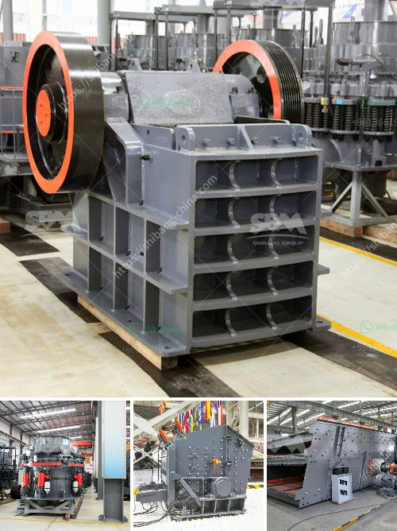

<h3>puzzolana 200tph cone crusher plant prices</h3>
Puzzolana 200 tph cone crusher plant prices are well-known for their innovative designs and engineering excellence. The compact structure of this crusher makes it suitable for crushing medium-hard and abrasive materials. It is widely used in mining, metallurgy, building materials, chemical and other industries. This machine not only has a high production capacity but also saves on electricity and maintenance costs.

The cone crusher plant has a wide range of applications, such as crushing hard rock, ore, slag, refractory material, etc. It is ideal for secondary and tertiary crushing. Cone crushers feature a unique combination of crusher speed, throw, and cavity design. This combination is known for providing higher capacity and superior product quality compared to other types of crushers.

Puzzolana cone crusher plant prices are very affordable and economic for small and medium scale crushing projects. International certifications such as CE and ISO have been obtained, and our quality crushers and other equipment are well received by various countries, such as Russia, Kazakhstan, Azerbaijan, Turkey, Kuwait, South Africa, Egypt, Vietnam, Malaysia, India, Australia, Korea, Canada, and the European Union, etc.

In addition to the cone crusher plant, Puzzolana offers a complete range of crushing solutions with jaw crushers, impact crushers, gyratory crushers, swing hammer crushers, etc. These crushers are robust, heavy duty, and need little maintenance. The swing jaw is suspended on the eccentric shaft, leading to a much more compact design than that of the double toggle jaw crusher.

All the crushers in Puzzolana range can be customized as per customer requirements. The crushers are designed to be reliable and long-lasting, with minimal downtime and low operating costs. Thus, Puzzolana is the best choice for customers who want to invest in stone crushing plants.

Overall, puzzolana cone crusher plant prices are reasonable and competitive. Puzzolana cone crushers are ideal for producing large volumes of graded products, while minimizing fines production. These crushers are ideal for secondary crushing where a high proportion of fines is undesirable. These machines are capable of producing a larger percentage of product fines and can deliver finished products at a lower cost per ton.
<h3>Contact us</h3><ul><li><strong>Whatsapp:&nbsp;<a href="https://wa.me/8613661969651">+8613661969651</a></strong></li><li><a href="https://swt.shibang-china.com/?git&amp;zhl&amp;puzzolana 200tph cone crusher plant prices"><strong>Online Service(chat now)</strong></a></li></ul><h3>Related</h3><ul><li><a href='pfw series impact crusher.md'>pfw series impact crusher</a></li><li><a href='vibratory screen manufacturer.md'>vibratory screen manufacturer</a></li><li><a href='stone crushing machinery.md'>stone crushing machinery</a></li><li><a href='300tpd mini cement plant task cost in india.md'>300tpd mini cement plant task cost in india</a></li><li><a href='jaw crusher for sale in south africa.md'>jaw crusher for sale in south africa</a></li></ul>