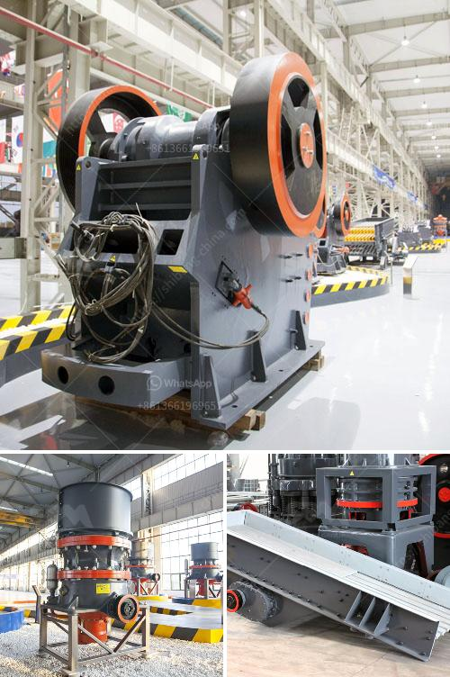

<h3>puzzolana crusher malaysia</h3>
Puzzolana, a reputed brand in the field of crushers, has been in the business of manufacturing crushers from its inception in 1964. Respected for its quality and durability, Puzzolana's crushers are suitable for a variety of applications, including quarrying, mining, cement plants, and construction projects.

One of the reasons why Puzzolana crushers are popular in Malaysia is their ability to produce high-quality aggregates reliably and efficiently. With an excellent track record, Puzzolana crushers have been used extensively in various infrastructure projects in the country, including highways, bridges, and buildings.

Puzzolana offers a wide range of crushers, including jaw crushers, cone crushers, and vertical shaft impactors. These crushers are known for their robust construction, ensuring durability and long-lasting performance. The crushers are also equipped with advanced features for optimum performance, such as a hydraulic system for easy adjustment of the crusher's settings and a balanced design for smooth operation.

Another key feature of Puzzolana crushers is their low operating cost. With their efficient design and low power consumption, these crushers help reduce energy costs significantly. Additionally, Puzzolana crushers are known for their minimal maintenance requirements, reducing downtime and increasing productivity.

Puzzolana crushers are also known for their versatility, with the ability to process a wide range of materials. Whether it is hard rock, limestone, river gravel, or granite, Puzzolana crushers can handle them all. This makes them suitable for various applications, from primary crushing to secondary and tertiary crushing.

In Malaysia, Puzzolana crushers have been used in several high-profile projects, including the PETRONAS Twin Towers, Kuala Lumpur International Airport, and the Penang Second Bridge. These projects required high-quality aggregates, and Puzzolana crushers were able to deliver the desired results.

The success of Puzzolana crushers in Malaysia can be attributed to the company's commitment to quality and innovation. Puzzolana invests heavily in research and development to constantly improve its products and stay ahead of the competition. The company also has a dedicated team of engineers and technicians who provide excellent after-sales support, ensuring customer satisfaction.

With its reliable performance, low operating cost, and versatility, Puzzolana crushers have become a preferred choice for many companies in Malaysia. Whether it is for large-scale infrastructure projects or small-scale construction works, Puzzolana crushers are a reliable and efficient solution.

Overall, Puzzolana crushers have made a significant impact in the Malaysian market. With their superior quality, durability, and low operating cost, they have become a trusted brand among construction companies, contractors, and quarry operators. As Malaysia continues to invest in infrastructure development, Puzzolana crushers will continue to play a vital role in shaping the country's construction industry.
<h3>Contact us</h3><ul><li><strong>Whatsapp:&nbsp;<a href="https://wa.me/8613661969651">+8613661969651</a></strong></li><li><a href="https://swt.shibang-china.com/?git&amp;zhl&amp;puzzolana crusher malaysia"><strong>Online Service(chat now)</strong></a></li></ul><h3>Related</h3><ul><li><a href='machinery used in cement factory.md'>machinery used in cement factory</a></li><li><a href='providers conveyor belts in mexico.md'>providers conveyor belts in mexico</a></li><li><a href='superfine grinding mill.md'>superfine grinding mill</a></li><li><a href='standard ratio for cement sand building blocks.md'>standard ratio for cement sand building blocks</a></li><li><a href='stone crushing machines uk.md'>stone crushing machines uk</a></li></ul>