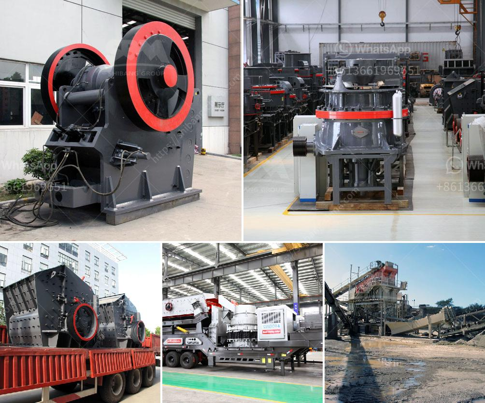

<h3>puzzolana stone crusher for sale</h3>
Puzzolana stone crusher for sale, 300-500 tph stone crusher plants in the domestic market, as well as in the Indian construction and mining industries, are experiencing a boom. The demand for crushing machines is increasing steadily due to the rapid growth of infrastructure projects, especially road and railway projects. These projects require a lot of aggregate material, making stone crushers essential equipment.

Puzzolana Machinery Fabricators, a leading manufacturer of crushing and screening equipment also supplies crushers for various applications in limestone, basalt, granite, iron ore mines, and diamonds. Puzzolana crushers can be used to crush various materials such as limestone, basalt, granite, iron ore, aggregate, and construction waste. They are among the most rugged, heavy-duty crushers available in the market. They are highly reliable and robust machines that come with a long lifespan.

1. Robust frame design to withstand the severe conditions encountered during quarrying and mining operations.

2. The machine is equipped with a hydraulic system for easy adjustment of the CSS (closed side setting) and simplification of the crushing process.

3. The crusher is equipped with a hydraulic system that adjusts the discharge setting to a predetermined value.

5. Impact bars and wear-resistant lining plates are installed on the feed chute and hopper to protect the machine from wear and tear.

6. The crusher is equipped with a dust suppression system to reduce the environmental impact and prevent dust emission.

7. The crusher can be configured with a diesel engine or an electric motor depending on the application.

Puzzolana crushers are available in various models such as single toggle jaw crushers, cone crushers, impact crushers, and screens. These models are designed to handle primary, secondary and tertiary crushing applications in a wide range of industries. They are cost-effective and provide high productivity and efficiency. With a wide range of optional features and accessories, Puzzolana crushers are customized to suit individual requirements and applications.

In conclusion, Puzzolana stone crushers are reliable and efficient machines suitable for crushing different types of rocks and minerals, such as limestone, basalt, granite, iron ore, and construction waste. They can be used in various industries, including mining and construction. In addition to crushing materials, it can also be used to crush aggregates, recycling materials, and in the process of artificial sand making. Puzzolana stone crushers are reliable and durable equipment that ensures high productivity and hassle-free operation.
<h3>Contact us</h3><ul><li><strong>Whatsapp:&nbsp;<a href="https://wa.me/8613661969651">+8613661969651</a></strong></li><li><a href="https://swt.shibang-china.com/?git&amp;zhl&amp;puzzolana stone crusher for sale"><strong>Online Service(chat now)</strong></a></li></ul><h3>Related</h3><ul><li><a href='found stone crusher in davao.md'>found stone crusher in davao</a></li><li><a href='ultra fine mill manufacturers in india.md'>ultra fine mill manufacturers in india</a></li><li><a href='quarry business for sale in nigeria.md'>quarry business for sale in nigeria</a></li><li><a href='200mm crusher sieve opening sizes.md'>200mm crusher sieve opening sizes</a></li><li><a href='gold mining crusher in nigeria cost.md'>gold mining crusher in nigeria cost</a></li></ul>