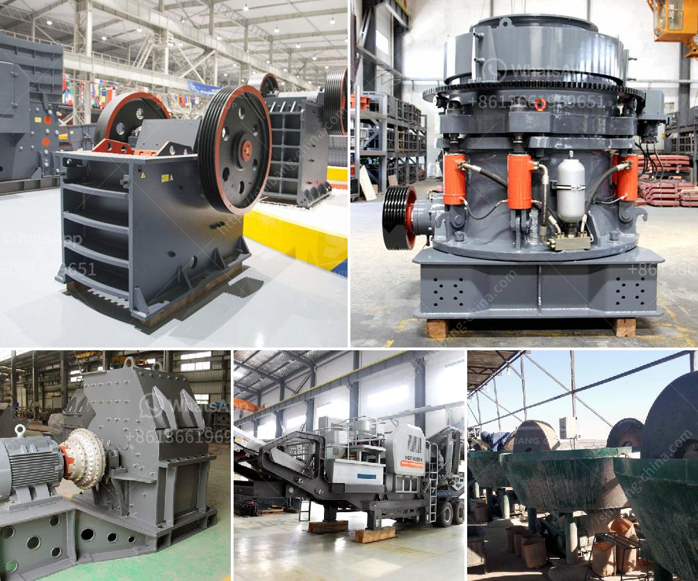

<h3>quarries crusher in nigeria</h3>
Quarries play a vital role in our daily lives. They provide the stones, sand and gravel that are used in building homes, roads and even entire cities. Without quarries, many of the material resources that we rely on for construction would be scarce or non-existent. One country that is rich in quarries is Nigeria. Nigeria is blessed with a variety of hard and soft rocks that can be used in construction, but it is important to have crushers in place in order to maximize the output of these materials.

A quarry crusher is a machine that breaks large stones into smaller ones. Based on the types of crushers used, it can be either a primary crusher or secondary crusher. Primary crushers are used in the first stage of stone processing. A machine that is classified as a primary crusher has a very high pressure power so that it can crush large stones to become smaller. Several types of machines used in the primary crusher process include jaw crusher, Gyratory Crusher, Crusher Impacter and Cone Crusher.

On the other hand, secondary crushers are used in the second stage of stone processing. The output of these crushers is much finer and smaller compared to primary crushers. This is because secondary crushers crush the stones into smaller pieces in order to produce aggregates for construction purposes. Some examples of secondary crushers include impact crushers, cone crushers, and sand making machines.

Having quarries and crushers in Nigeria is a proven way to ensure a steady supply of construction materials to meet the country's increasing demand for infrastructure and housing. Nigeria's population is growing rapidly, and there is a need for more housing and infrastructure to accommodate this growth. By having reliable quarries and crushers, construction companies can access the necessary materials to build these structures in a timely and cost-effective manner.

In addition, quarry crushers in Nigeria also play a crucial role in reducing the environmental impact of construction. When large stones are extracted from the quarry, they leave behind large holes that can disrupt the natural landscape. By using crushers, these large stones can be broken down into smaller pieces, minimizing the impact on the surrounding environment.

Furthermore, quarry crushers also contribute to the local economy by creating job opportunities. Quarrying and stone crushing require skilled labor and machinery, which translates into job opportunities for the local population. This can help boost the economy of the surrounding communities and improve the standard of living for the people living in those areas.

In conclusion, quarries and crushers are essential for the construction industry in Nigeria. They provide the necessary materials for building homes, roads, and infrastructure. Additionally, they help reduce the environmental impact of construction activities and create job opportunities for the local population. Having reliable quarries and crushers in Nigeria is a win-win situation for both the construction industry and the local communities.
<h3>Contact us</h3><ul><li><strong>Whatsapp:&nbsp;<a href="https://wa.me/8613661969651">+8613661969651</a></strong></li><li><a href="https://swt.shibang-china.com/?git&amp;zhl&amp;quarries crusher in nigeria"><strong>Online Service(chat now)</strong></a></li></ul><h3>Related</h3><ul><li><a href='vertical vertical grinding machine.md'>vertical vertical grinding machine</a></li><li><a href='cement ball mill cement mill for sale.md'>cement ball mill cement mill for sale</a></li><li><a href='100 tph cone crusher price.md'>100 tph cone crusher price</a></li><li><a href='stone crusher for gold mining indonesia.md'>stone crusher for gold mining indonesia</a></li><li><a href='crusher for granite.md'>crusher for granite</a></li></ul>