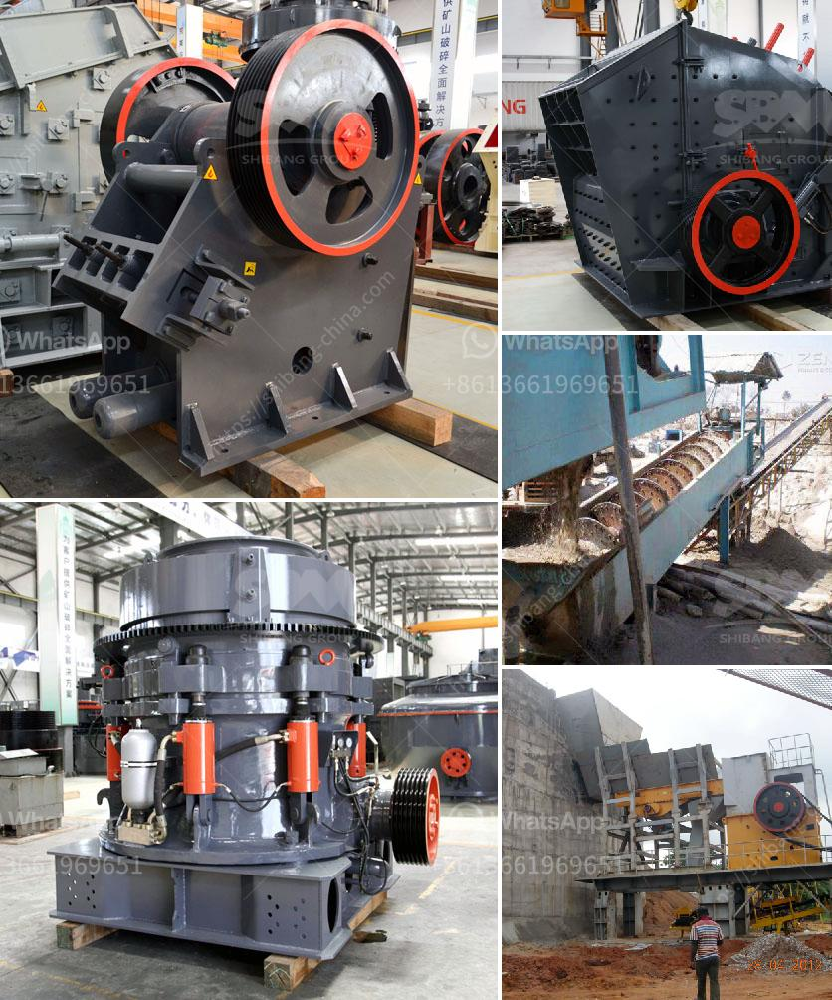

<h3>quarry business for sale in nigeria</h3>
Quarrying is a thriving industry in Nigeria, with various types of large-scale quarry operations at different locations throughout the country. With industry trends gradually shifting towards solid mineral resources and lucrative opportunities arising in the sector, the Federal Government of Nigeria has commenced plans to strategically position the industry as a primary source of revenue for the nation. Thus, investing in a quarry business in Nigeria could be a smart decision for entrepreneurs.

A quarry is a profitable venture for any individual who possesses a good understanding of the industry and sufficient finances to start it. Depending on the scale and type of quarry business, there are hundreds of lucrative opportunities for investors, especially for those who intend to venture into the mining of granite, limestone, marble, and other sales-demanding stones. Quarry operations can be large and profitable operations in Nigeria.

Starting a quarry business in Nigeria requires low capital investments and generates a high return on investment (ROI) due to the plentiful availability of granite, limestone, and other materials used in constructing roads, buildings, bridges, and other infrastructure. Investors can expect a significant stream of income from quarry operations if properly managed.

The first step when planning to start a quarry business is to identify the quarry site to extract the raw materials from. Based on the location, the investor can choose to set up the quarry either as a small-scale or large-scale operation. In a small-scale quarry, at least 300 tons of raw materials need to be extracted daily to meet local demand.

Quarries can be situated in any location across the country as long as they meet regulations and possess the required equipment, licenses, and permits. Some of the equipment needed include crushers, excavators, dumpers, pay loaders, generators, and Waybridge. These equipment can be sourced from reputable suppliers within Nigeria or imported.

After establishing the quarry, the next step is to engage in marketing activities. This involves partnering with construction companies, real estate agents, individuals, and government agencies that require granite, limestone, and other materials for construction purposes. Creating a network and establishing relationships with potential customers is crucial for the success of the quarry business.

Furthermore, quarry owners must ensure that their operations comply with all government regulations and environmental standards. Environmental impact assessment reports and quarry permits must be obtained to legalize the operations. These documents also serve as evidence that the business is operating legally and give potential buyers confidence in making an investment.

Considering the huge potential for profit in the quarry industry, quarry businesses in Nigeria are expected to continue thriving for years to come. With the right equipment, financial backing, and networking capabilities, entrepreneurs can take advantage of the numerous opportunities in the industry and build a profitable and sustainable business.

In conclusion, investment in the quarry business in Nigeria is highly lucrative due to the abundance of mineral resources, especially granite, limestone, and marble. While there are numerous challenges faced by quarry operators, the investment returns make it a worthwhile venture. Entrepreneurs looking to invest in the quarry business should conduct thorough research and seek expert advice to ensure their success in this competitive industry.
<h3>Contact us</h3><ul><li><strong>Whatsapp:&nbsp;<a href="https://wa.me/8613661969651">+8613661969651</a></strong></li><li><a href="https://swt.shibang-china.com/?git&amp;zhl&amp;quarry business for sale in nigeria"><strong>Online Service(chat now)</strong></a></li></ul><h3>Related</h3><ul><li><a href='crusher stone for sale.md'>crusher stone for sale</a></li><li><a href='second hand small cement mill in uae.md'>second hand small cement mill in uae</a></li><li><a href='impact crushers turkey.md'>impact crushers turkey</a></li><li><a href='stone crushers for sale.md'>stone crushers for sale</a></li><li><a href='how much price of ball mill.md'>how much price of ball mill</a></li></ul>