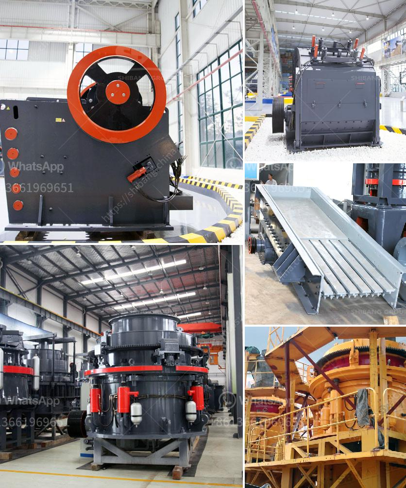

<h3>quarry business in nigeria</h3>
Quarrying is a thriving industry in Nigeria. The country is richly endowed with granite stone and other related solid minerals like Marble, Dolomite, and Basalt, among others. Industrial minerals are extremely important to the nation's economic development and prosperity as they have various applications in construction, building, manufacturing, and agriculture sectors.

Quarrying simply refers to the extraction of granite rocks and other solid mineral resources from the earth crust. On a commercial scale, quarrying is a lucrative business venture in Nigeria due to its vast market and profitability. To properly understand the business, it is essential to first examine the various factors responsible for the economic boom of quarrying in Nigeria.

One of the key factors responsible for the increased demand for granite aggregates is the massive government investment in infrastructural development projects. The Nigerian government, in its bid to bridge the infrastructural deficit in the country, has embarked on various road construction projects, housing estates, and major civil works. These projects require large quantities of granite aggregates, which can only be sourced through quarrying.

Furthermore, the construction industry, including contractors and real estate developers, heavily relies on granite aggregates for various construction activities such as road sub-base and pavement materials, concrete production, and building foundations. The rapid urbanization and population growth in Nigeria have significantly fueled the demand for housing and infrastructural development, making quarrying a profitable business.

The quarry business is a capital-intensive venture that requires substantial startup capital. These funds are needed for a range of machinery, equipment, and infrastructure needs such as plants, crushers, weighbridges, generators, and office spaces, among others. Additionally, securing a quarry site, leasing or buying the necessary equipment, and complying with regulatory requirements can be financially demanding.

Despite the initial capital requirements, the quarry business in Nigeria has the potential to be a highly lucrative venture. In addition to the value of the raw materials extracted, the industry generates revenue from various other revenue streams including site rentals, sales of aggregates to construction companies, and ancillary services such as transportation and logistics. With effective project management and cost control measures, quarry business owners can maximize returns on their investments.

However, like any other business sector, quarrying in Nigeria faces its own challenges. One of the major challenges is the issue of illegal mining activities, especially in rural areas where regulations are lax. These unauthorized operations pose environmental hazards, compromise safety standards, and undermine the viability of legal quarry businesses. Government intervention and stricter enforcement of regulations are required to address these challenges.

Furthermore, fluctuating global oil prices affect construction activities and infrastructural developments in the country. In times of economic downturn, there may be a decrease in the demand for granite aggregates, which can affect the profitability of quarry businesses.

In conclusion, quarrying is a thriving business in Nigeria with vast untapped potential. The industry offers an array of opportunities for entrepreneurs and investors to explore. It plays a crucial role in the nation's economic development and job creation. However, stakeholders in the sector must work together to address challenges such as illegal mining activities and the impact of oil price fluctuations. With effective regulation and strategic planning, the quarry business in Nigeria can continue to prosper and contribute significantly to the nation's growth.
<h3>Contact us</h3><ul><li><strong>Whatsapp:&nbsp;<a href="https://wa.me/8613661969651">+8613661969651</a></strong></li><li><a href="https://swt.shibang-china.com/?git&amp;zhl&amp;quarry business in nigeria"><strong>Online Service(chat now)</strong></a></li></ul><h3>Related</h3><ul><li><a href='crushing and screening plant supplier china.md'>crushing and screening plant supplier china</a></li><li><a href='stone crusher machine sale germany.md'>stone crusher machine sale germany</a></li><li><a href='shafts of a ball mill.md'>shafts of a ball mill</a></li><li><a href='feasibility study on stone crushing.md'>feasibility study on stone crushing</a></li><li><a href='stone crushets for sale south aftica.md'>stone crushets for sale south aftica</a></li></ul>