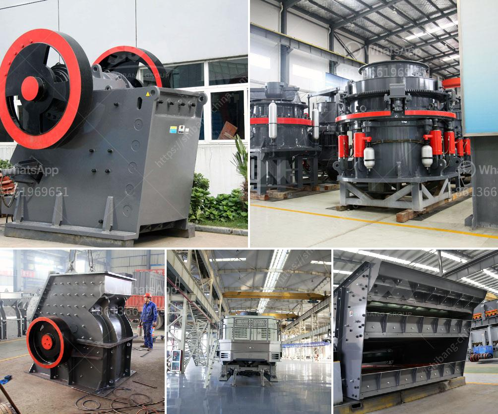

<h3>quarry business in south africa</h3>
South Africa is known for its abundance of mineral resources. It is estimated to have the world's fifth-largest mining sector in terms of gross domestic product value and its mining industry is the backbone of the country's economy. Over the years, South Africa's mining industry has been flourishing and it is currently one of the leading contributors to the country's GDP.

A quarry business, also known as mining, is one of the most profitable businesses to own and operate in South Africa. This is due to the fact that quarrying activities produce materials such as crushed stone, aggregate, gravel, and sand which are used in various sectors of the economy, including infrastructure development, construction, and the production of cement, among others.

Quarry activities in South Africa have been in existence for thousands of years and were integral in the early development of human settlements in the country. Today, quarrying continues to play a vital role in local communities and the national economy. As such, it is crucial to understand the business of quarrying in South Africa and the associated challenges and opportunities.

Starting a quarry business requires a significant initial investment. This includes securing the necessary licenses and permits, acquiring land or lease rights, and purchasing or leasing heavy machinery and equipment. However, once the quarry is up and running, the operating costs are relatively low, making it a highly profitable venture.

South Africa's rich mineral reserves are a major advantage for quarry businesses. The country is home to a wide range of minerals including gold, platinum, coal, manganese, iron ore, copper, and uranium. In addition, there are abundant reserves of industrial minerals such as limestone, diamonds, and dimension stone, making South Africa a major supplier of these materials.

The demand for materials from quarries remains consistent and is driven by ongoing construction projects, infrastructure development, and urbanization. As South Africa continues to invest in its infrastructure, including roads, bridges, and buildings, the demand for quarry materials is expected to increase. This presents a significant growth opportunity for quarry businesses in the country.

However, quarrying also comes with its fair share of challenges. Environmental impact is a major concern, with quarrying activities potentially causing soil erosion, deforestation, and habitat destruction. It is imperative for quarry businesses to implement responsible mining practices, including land rehabilitation and biodiversity conservation, to mitigate these negative impacts.

Additionally, the fluctuating international commodity prices and global economic conditions can influence the profitability of quarry businesses in South Africa. The volatility in the global mining industry can impact the demand and prices of raw materials, thereby affecting the profitability of quarrying operations.

In conclusion, quarry businesses in South Africa are one of the most profitable and viable options for entrepreneurs. The sector is supported by a strong demand for materials used in various industries and ongoing infrastructure development projects. However, it is essential for quarry businesses to adopt sustainable practices and be adaptable to changing market conditions to ensure long-term success.
<h3>Contact us</h3><ul><li><strong>Whatsapp:&nbsp;<a href="https://wa.me/8613661969651">+8613661969651</a></strong></li><li><a href="https://swt.shibang-china.com/?git&amp;zhl&amp;quarry business in south africa"><strong>Online Service(chat now)</strong></a></li></ul><h3>Related</h3><ul><li><a href='small scale quarry stone making machine.md'>small scale quarry stone making machine</a></li><li><a href='high performance mobile crusher plant.md'>high performance mobile crusher plant</a></li><li><a href='portable hammer mill australia in perth.md'>portable hammer mill australia in perth</a></li><li><a href='200mm crusher sieve opening sizes.md'>200mm crusher sieve opening sizes</a></li><li><a href='prices of crusher machine in pakistan.md'>prices of crusher machine in pakistan</a></li></ul>