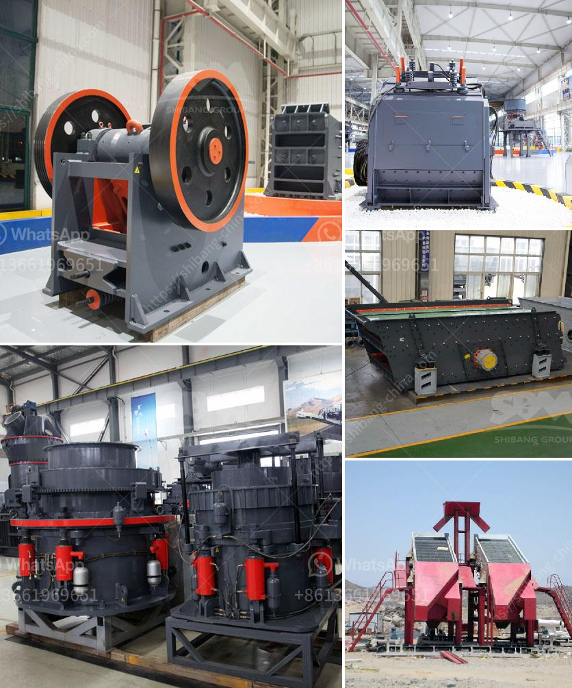

<h3>quarry crusher equipment china</h3>
The quarry crusher equipment market in China is continuing to develop, as the demand for crushers increases. Due to the extensive use of mining machinery in the quarrying and mining industry, the demand for quarry crusher equipment is also growing. Rapid economic growth and urbanization, with infrastructure development projects, such as rail, road, and housing, and the increasing demand for aggregate materials also contribute to the growth of the quarry crusher equipment market.

China, being a populous country with a large land area, has a high demand for construction aggregates. The rapid urbanization and industrialization of China have led to a surge in demand for construction materials, such as sand, gravel, crushed stones, and recycled concrete. This has created a favorable environment for the growth of the quarry crusher equipment market.

Quarry crusher equipment, also known as quarry stone crushers, is widely used in the crushing and sand making industry, such as granite, limestone, river pebble, cement clinker, quartz stone, iron ore, bauxite, etc. In order to meet the diversified needs of customers, various types of quarry crusher equipment are being developed and improved, such as jaw crusher, impact crusher, cone crusher, mobile crushing plant, sand making machine, etc.

Chinese quarry crusher equipment manufacturers have made significant progress emphasizing technological innovation and improving production capacity. They have realized the importance of environmental protection and energy conservation, and have continuously developed and improved the equipment. For example, energy-saving and environmentally friendly crushers have been introduced to reduce energy consumption and pollution during the crushing process.

In addition, the Chinese government has introduced various policies to promote the development of the quarry crusher equipment industry. For instance, the "One Belt, One Road" initiative, launched by the Chinese government, aims to promote infrastructure development and connectivity among countries along the route. This initiative provides a vast market for quarry crusher equipment, as it requires large quantities of aggregates for infrastructure construction.

Furthermore, the Chinese government has also been encouraging the development of green and low-carbon industries, including the quarry mining industry. This has led to the introduction of greener and more efficient quarry crusher equipment, which not only improves productivity but also reduces environmental pollution.

China, being the world's largest producer and consumer of construction aggregates, has enormous potential for the quarry crusher equipment market. The increasing demand for aggregates in China, driven by infrastructure development projects and urbanization, provides a huge market for quarry crusher equipment manufacturers.

However, challenges remain. The fierce market competition has led to the emergence of numerous quarry crusher equipment manufacturers, resulting in uneven product quality and service levels. Therefore, customers need to carefully select reliable and reputable manufacturers who can provide high-quality equipment and professional after-sales service.

In conclusion, the quarry crusher equipment market in China is promising and offers extensive opportunities for growth. The increasing demand for construction aggregates, backed by rapid urbanization and infrastructure development projects, drives the demand for quarry crusher equipment. With the continuous efforts of manufacturers to improve technological innovation and the Chinese government's support for the industry, the quarry crusher equipment market in China is set to witness significant growth in the coming years.
<h3>Contact us</h3><ul><li><strong>Whatsapp:&nbsp;<a href="https://wa.me/8613661969651">+8613661969651</a></strong></li><li><a href="https://swt.shibang-china.com/?git&amp;zhl&amp;quarry crusher equipment china"><strong>Online Service(chat now)</strong></a></li></ul><h3>Related</h3><ul><li><a href='limestone ball mill.md'>limestone ball mill</a></li><li><a href='bauxite calcination plant cost in india.md'>bauxite calcination plant cost in india</a></li><li><a href='how to design surge bin hopper crusher.md'>how to design surge bin hopper crusher</a></li><li><a href='100tph jaw crusher.md'>100tph jaw crusher</a></li><li><a href='long distance conveyor of lafarge cement in bangladesh.md'>long distance conveyor of lafarge cement in bangladesh</a></li></ul>