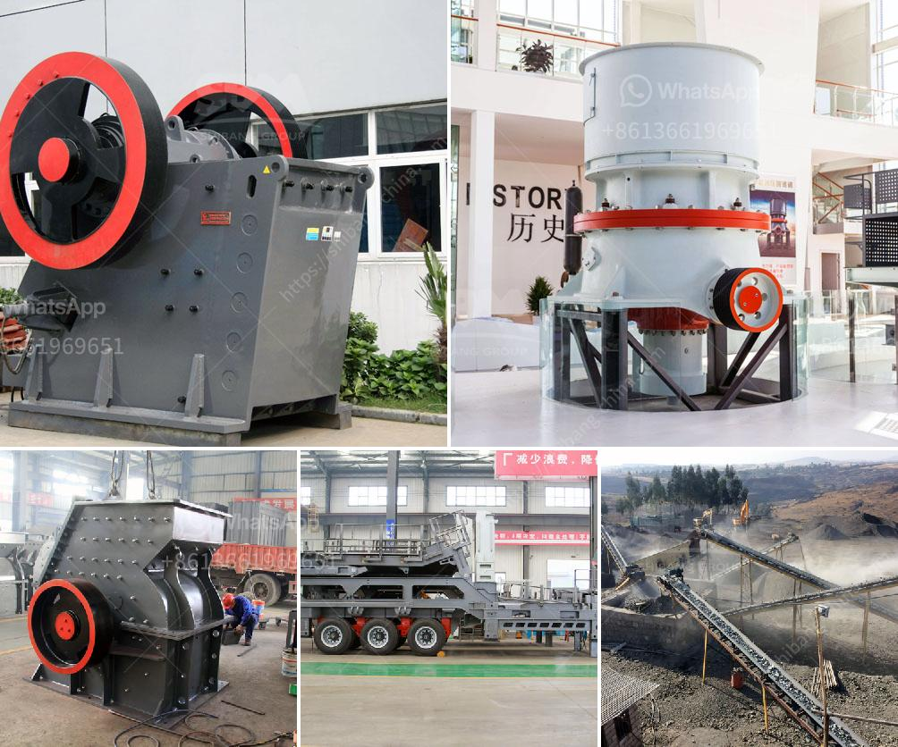

<h3>quarry crusher plant location in malaysia</h3>
Quarrying is one of the major industries in Malaysia and the country has a well-established quarry sector with more than 30 years of operational experience. Many quarry plants are strategically located to serve the market and their customers in a more efficient and cost-effective way.

One of these highly efficient quarry crusher plants is located in Tasek Industrial Estate, Ipoh. This particular quarry plant specializes in the crushing and screening of various types of rock and stone, with different sizes ranging from small to large. This plant consists of a primary jaw crusher, secondary cone crusher, and tertiary vertical shaft impact crusher. It also has a series of screens, feeders, and conveyors to facilitate the efficient flow of materials. The plant is fully automated and is operated by a team of experienced professionals.

The location of this quarry crusher plant in Malaysia is strategic, as it is located in the central part of the country. This location allows for easy transportation of mined limestone to other parts of Peninsular Malaysia, giving it a competitive advantage for supplying raw materials to various industries and export markets.

In addition, the plant is surrounded by extensive quarries and long-standing partnerships with neighboring quarry operators, enabling it to have a continuous supply of high-quality raw materials. This not only ensures the consistent production of quality aggregates but also enables the plant to have a wide range of products to meet the diverse needs of its customers.

Furthermore, being located in Tasek Industrial Estate provides easy access to major highways and ports, allowing for efficient distribution of the finished products. This means that the quarry crusher plant can easily serve the construction industry, infrastructure projects, and various other sectors, both locally and internationally. The flexibility of the plant also allows for the production of specialized products to cater to specific customer requirements.

Another notable aspect of this quarry crusher plant is its commitment to environmental sustainability. The plant has implemented various measures to minimize its environmental impact, such as dust suppression systems, water recycling systems, and noise control measures. This not only ensures compliance with environmental regulations but also showcases the plant's dedication to responsible and sustainable operations.

Overall, the strategic location of this quarry crusher plant in Malaysia allows for easy access to raw materials and efficient distribution of finished products. It is a vital component of the construction industry and other sectors, playing a crucial role in the development of infrastructure and economic growth. With its commitment to quality, productivity, and sustainability, this quarry crusher plant continues to contribute significantly to Malaysia's quarrying industry.
<h3>Contact us</h3><ul><li><strong>Whatsapp:&nbsp;<a href="https://wa.me/8613661969651">+8613661969651</a></strong></li><li><a href="https://swt.shibang-china.com/?git&amp;zhl&amp;quarry crusher plant location in malaysia"><strong>Online Service(chat now)</strong></a></li></ul><h3>Related</h3><ul><li><a href='coal crushing and screening plant setup.md'>coal crushing and screening plant setup</a></li><li><a href='ball mill catalogue.md'>ball mill catalogue</a></li><li><a href='detail project report on quartz powder plant.md'>detail project report on quartz powder plant</a></li><li><a href='ball mill for size reduction.md'>ball mill for size reduction</a></li><li><a href='crusher machine tanzania.md'>crusher machine tanzania</a></li></ul>