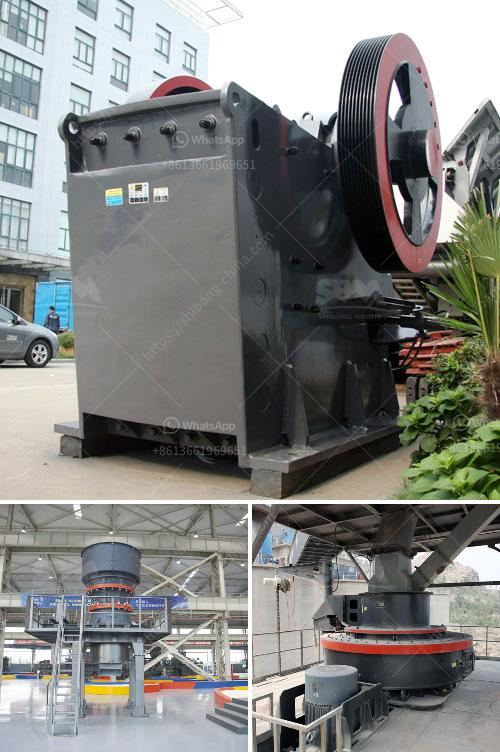

<h3>quarry crusher quartz</h3>
In recent years, there has been a growing demand for quartz as a construction material, particularly for its use in producing aggregates. The growing popularity of quartz can be attributed to its numerous beneficial properties and its aesthetic appeal. As a result, many quarry crushers are now focusing on extracting and crushing quartz to meet this increasing demand.

Quarry crusher quartz is a type of stone crusher that is used to crush quartz into small pieces for various purposes. The quarry crusher consists of a vibrating feeder, jaw crusher, impact crusher, vibrating screen, belt conveyor and other equipment. Each component has its own specific functions and duties.

Quartz is a crystalline mineral that has numerous physical and chemical properties. It is extremely hard, has high melting and boiling points, and is resistant to corrosion and weathering. These properties make quartz an ideal material for use in the construction industry.

One of the main uses of crushed quartz is as an aggregate in concrete. When mixed with cement and water, crushed quartz forms a strong and durable concrete that can be used for various construction purposes, such as building foundations, roads, and pavements. The high hardness of quartz also enhances the strength and durability of the concrete.

In addition to being used in concrete, crushed quartz can also be used as a base material for asphalt. It is mixed with asphalt to create a strong and durable material that can withstand heavy traffic and extreme weather conditions. Crushed quartz helps to bind the asphalt together, preventing it from cracking or crumbling over time.

Furthermore, quartz can be used as a decorative material in buildings. Its unique and attractive appearance adds a touch of elegance and sophistication to any space. Crushed quartz can be used as a decorative aggregate in terrazzo flooring, countertops, and even in landscaping projects. Its sparkle and shine create a visually appealing environment, making it a popular choice for architects and designers.

With the increasing demand for quartz in the construction industry, quarry crushers are working tirelessly to extract and crush quartz efficiently. They employ advanced equipment and techniques to ensure that the quartz is extracted in the most efficient manner possible. Additionally, they follow strict quality control measures to ensure that only the highest quality quartz is produced.

In conclusion, quarry crusher quartz is proving to be a valuable material in the construction industry. Its numerous physical and chemical properties make it ideal for use in producing aggregates, which are essential in concrete and asphalt production. Additionally, its aesthetic appeal adds value to decorative applications in buildings. With its growing popularity, quarry crushers are playing a crucial role in extracting and crushing quartz to meet the increasing demand. As the construction industry continues to thrive, the demand for quarry crusher quartz is only expected to increase.
<h3>Contact us</h3><ul><li><strong>Whatsapp:&nbsp;<a href="https://wa.me/8613661969651">+8613661969651</a></strong></li><li><a href="https://swt.shibang-china.com/?git&amp;zhl&amp;quarry crusher quartz"><strong>Online Service(chat now)</strong></a></li></ul><h3>Related</h3><ul><li><a href='fluorite ore processing equipment manufacturer.md'>fluorite ore processing equipment manufacturer</a></li><li><a href='crusher stone for sale.md'>crusher stone for sale</a></li><li><a href='silica sand plant.md'>silica sand plant</a></li><li><a href='used nd hand coal crusher sizer.md'>used nd hand coal crusher sizer</a></li><li><a href='quarry business in nigeria.md'>quarry business in nigeria</a></li></ul>