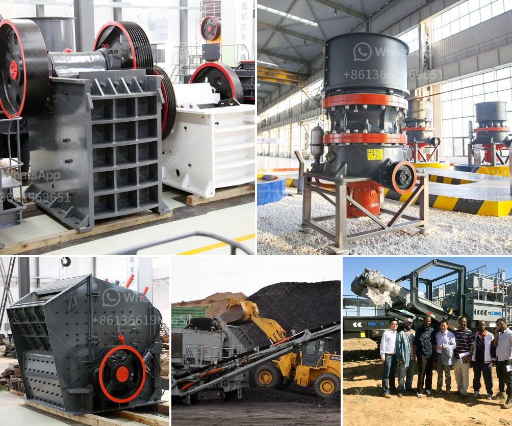

<h3>quarry crushers south africa</h3>
South Africa is known for its mining industry. This country is rich in natural resources with an abundance of minerals, such as platinum, gold, diamond, coal, and iron ore. Thanks to this, South Africa is one of the leading mining countries in the world. But mining also comes with its challenges, one of which is the need for efficient and reliable crushers to break down the rocks extracted from quarries into smaller, more manageable sizes. Quarry crushers play a crucial role in South Africa's mining industry, helping miners achieve maximum productivity and minimizing operational costs.

Quarry crushers are machines used to break down solid materials into smaller, more manageable pieces. They are commonly used in the mining industry to reduce the size of ore extracted from the earth. These crushers come in various sizes and configurations to suit different crushing requirements. Jaw crushers, cone crushers, impact crushers, and gyratory crushers are commonly utilized in quarry crushing operations.

One of the primary benefits of quarry crushers is their ability to produce a wide range of sizes and shapes of aggregate. Aggregate is a crucial component in construction, and its quality and size distribution are crucial for the strength and durability of concrete. Quarry crushers allow miners to produce aggregate with specific sizes, meeting the requirements of different construction projects. This versatility is especially beneficial for remote construction sites in South Africa, where the availability of construction materials is limited.

Quarry crushers also help minimize transportation costs. By breaking down materials on-site, rather than transporting them to a central crusher location, miners can reduce the amount of material that needs to be transported. This is particularly advantageous for remote mining sites far away from main cities or transport hubs. Minimizing transportation distances not only saves time but also reduces fuel consumption and carbon emissions, contributing to a more sustainable mining industry.

In addition to their cost-saving benefits, quarry crushers also enhance safety in mining operations. Prior to the development of quarry crushers, miners had to manually break down the extracted materials using hammers or explosives. These methods were not only time-consuming but also dangerous. Quarry crushers automate and streamline the crushing process, minimizing the risk of accidents and injuries. They feature safety mechanisms to protect workers from potential hazards, such as getting caught in moving parts or being exposed to rock fragments during the crushing process.

Overall, quarry crushers are a vital tool in South Africa's mining industry. They efficiently break down extracted materials into smaller, more manageable sizes, enable the production of specific aggregate sizes, reduce transportation costs, and enhance safety in mining operations. As the mining industry continues to evolve and face new challenges, the demand for efficient and reliable quarry crushers will remain strong, ensuring sustainable mining practices and supporting the growth of South Africa's economy.
<h3>Contact us</h3><ul><li><strong>Whatsapp:&nbsp;<a href="https://wa.me/8613661969651">+8613661969651</a></strong></li><li><a href="https://swt.shibang-china.com/?git&amp;zhl&amp;quarry crushers south africa"><strong>Online Service(chat now)</strong></a></li></ul><h3>Related</h3><ul><li><a href='process of gypsum board manufacturing.md'>process of gypsum board manufacturing</a></li><li><a href='crusher plant manufacturer.md'>crusher plant manufacturer</a></li><li><a href='stone crusher machine south africa.md'>stone crusher machine south africa</a></li><li><a href='mantencion a cone crusher.md'>mantencion a cone crusher</a></li><li><a href='ball mill plant in south africa.md'>ball mill plant in south africa</a></li></ul>